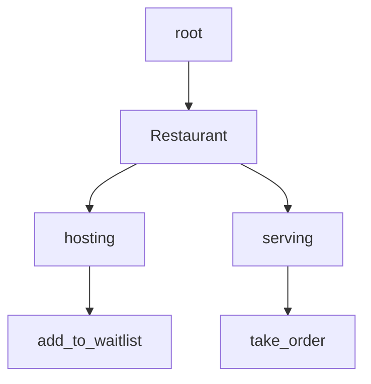

# Rust

:cheese_wedge: 前置知识：建议提前修过 C++  语言的程序设计基础与面向对象程序设计基础 (OOP) 课程

:mortar_board: 讲师：郑友捷 @Azure_Stars

:date: 日期：7 月 23 日星期日、7 月 25 日星期二

---

《Rust》是由 Graydon Hoare 自主研发的一款全新、安全、高效的编程语言。故事发生在一个被称作「清华大学科协暑培」的幻想世界，在这里，被选中的人将被授予「Rust-Analyzer」，导引智能编译器之力。你将扮演一位名为「Rust 魔怔人」的神秘角色，在自由的 coding 中邂逅前所未闻、简明实用的 Rust 编程规则，和他们一起击败 Segmentation Fault、内存泄漏、上千行编译报错信息等 C++  高血压时刻，找回丢失的开发体验——同时，逐步发掘「编程界的 Genshin Impact」的真相。

Rust 可以带给你：

1. 在人智导、软件工程、操作系统等多个专业核心课上多一个选项，尤其是操作系统课程中，基本大潮流都是使用 Rust 语言

2. 掌握一门近年非常热门的高效、安全的编程语言，摆脱 C++  的冗余规则

3. 获得全新的编程设计理念，开阔视野

在暑培的 Rust 入门课程中，你将：

1. 学习 Rust 的基本语法（其实和 C++  区别不大），所有权、泛型规则、标准库用法等内容

2. 与已经学到的 C++  内容进行对比，从而了解到 Rust 的特有设计理念

3. 在我们给出的 Rust 应用框架上面进行必要的补全，之后可以得到一个可视化的 Rust 应用实现，从而加深自己的学习理解。

下面放上一张 Rust 的可爱吉祥物 logo~


:movie_camera: [课程回放 (1)](https://www.bilibili.com/video/BV1sc411w7LP)

:movie_camera: [课程回放 (2)](https://www.bilibili.com/video/BV1Tc411F7co)

:books: [作业 (1)](#1)

:books: [作业 (2)](https://github.com/sast-summer-training-2023/sast2023-rust/tree/main/hw2)

## 课前准备

> 听说成为贵系大佬的第一步是能够熟练地配置各种环境.jpg

**注意：我们建议大家使用 Linux 环境（对于 Windows 用户可以使用 WSL）进行 Rust 相关开发，并针对 Mac 用户进行了一定调整。不过为了满足不同的需求，我们给出了各种操作系统环境下的配置需求，但课上不会涉及 Windows 环境的配置相关问题，请大家谨慎选择。**


### WSL 环境中配置

#### 前言

WSL 全称为 Windows Subsystem for Linux，即可以在 Windows 机器上提供一个 Linux 环境。相关的配置说明已经在暑培的 Linux 课程中给出。我们假设大家都已经拥有一个完成基本配置的 WSL2 环境，否则请大家移步 Linux 课程文档进行配置。


本课程建议使用的 Linux 发行版是 Debian，并且版本不低于 Debian Bullseye（Debian 11），推荐使用 Debian Bookworm（Debian 12）。

如果你使用了其他的 Linux 发行版：

- Ubuntu：建议升级到 22.04 或者 20.04
- Arch Linux/NixOS/Gentoo：建议保持滚动更新到最新版
- CentOS：建议重装成 Debian
- Fedora/openSUSE：建议使用最新的稳定版本


#### 安装 rustup

请运行如下指令：

```shell
curl --proto '=https' --tlsv1.2 -sSf https://sh.rustup.rs | sh
```

如果显示错误 `Command 'curl' not found` 的错误，并且运行的 WSL 是 Debian 或者 Ubuntu 发行版，请运行下面的命令：

```shell
sudo apt update
sudo apt install -y curl
```

安装完成后，重新运行上面的 rustup 安装命令。

如果网络正常，rustup 安装命令会提示下面的信息：

```
The cargo, rustc, rustup and other commands will be added to
Cargo's bin directory, located at:

  /home/yoimiya/.cargo/bin

This path will then be added to your PATH environment variable by
modifying the profile files located at:

  /home/yoimiya/.profile
  /home/yoimiya/.bashrc
  /home/yoimiya/.zshenv

You can uninstall at any time with rustup self uninstall and
these changes will be reverted.

Current installation options:


   default host triple: x86_64-unknown-linux-gnu
     default toolchain: stable (default)
               profile: default
  modify PATH variable: yes

1) Proceed with installation (default)
2) Customize installation
3) Cancel installation
>
```

如果你<s>不想动脑子</s>没有特殊需求，可以直接选择默认安装，此时输入 `1` 并且回车，等待一段时间之后即可完成安装。

若输出如下信息，说明安装成功：

```shell
Rust is installed now. Great!

To get started you may need to restart your current shell.
This would reload your PATH environment variable to include
Cargo's bin directory ($HOME/.cargo/bin).

To configure your current shell, run:
source $HOME/.cargo/env
```


#### 测试是否安装成功

启用终端，输入如下指令 `rustc --version`，若输出类似下方的版本信息，则说明安装成功。

```shell
$ rustc 1.72.0-nightly (f0411ffce 2023-05-30)
```


若显示 `Command 'rustc' not found`，可以尝试关闭终端，重启之后运行相同指令。若仍然出现相同问题，则请检查环境变量是否配置正常。


WSL 下的环境变量一般存储在 `~/.bashrc` 下，而 `cargo` 包的相关文件存储路径由安装时决定，依据步骤 2 中输出的信息，在我的电脑上存储在 `~/.cargo/bin`，大家可以根据自己的安装脚本输出信息进行查找，并将其添加到环境变量中。


### Mac 环境中配置

#### 安装 Homebrew

以下内容参考于 [homebrew | 镜像站使用帮助 | 清华大学开源软件镜像站 | Tsinghua Open Source Mirror](https://mirrors.tuna.tsinghua.edu.cn/help/homebrew/)

Homebrew 虽然与 rustup 的安装没有直接关系，但却可以为后续 rust 安装其他依赖提供支持，所以我们建议大家提前安装。

首先，打开 Launchpad（启动台），在搜索栏中输入 Terminal（中文系统则是 `终端`），并且打开，依次执行以下指令。

1. 设置 Homebrew 镜像

    ```shell
    export HOMEBREW_INSTALL_FROM_API=1
    export HOMEBREW_API_DOMAIN="https://mirrors.tuna.tsinghua.edu.cn/homebrew-bottles/api"
    export HOMEBREW_BOTTLE_DOMAIN="https://mirrors.tuna.tsinghua.edu.cn/homebrew-bottles"
    export HOMEBREW_BREW_GIT_REMOTE="https://mirrors.tuna.tsinghua.edu.cn/git/homebrew/brew.git"
    export HOMEBREW_CORE_GIT_REMOTE="https://mirrors.tuna.tsinghua.edu.cn/git/homebrew/homebrew-core.git"
    ```

2. 从本镜像下载安装脚本并安装 Homebrew

    ```shell
    git clone --depth=1 https://mirrors.tuna.tsinghua.edu.cn/git/homebrew/install.git brew-install
    /bin/bash brew-install/install.sh
    rm -rf brew-install
    
    brew update
    ```


#### 安装 rustup

Mac 环境下安装 rustup 的方式与 WSL 的方式类似，即均可以通过官方脚本直接安装。请在终端下运行如下指令：

```shell
$ curl --proto '=https' --tlsv1.2 -sSf https://sh.rustup.rs | sh
```

其他相关的措施与 WSL 环境配置中类似，故不在此阐释。

### 测试是否安装成功

启用终端，输入如下指令 `rustc --version`，若输出类似下方的版本信息，则说明安装成功。

```shell
$ rustc 1.72.0-nightly (f0411ffce 2023-05-30)
```

若显示 `Command 'rustc' not found`，可以尝试关闭终端，重启之后运行相同指令。若仍然出现相同问题，则请检查环境变量是否配置正常。


### Windows 环境下配置

**再次建议：如果你没有预先安装 Visual Studio，请不要在该环境下配置，否则可能会占据你大量内存空间，同时可能出现奇怪的错误**

若你的电脑上没有 **Visual Studio**，还想要头铁配置，请参考这个网址：[安装 Rust 环境 - Rust 语言圣经 (Rust Course)](https://course.rs/first-try/installation.html)

#### 下载安装程序

请访问 `https://www.rust-lang.org/tools/install`，并选择 `DOWNLOAD RUSTUP-INIT.EXE`（详细版本由自身电脑决定，多为 64 位版本），下载对应的安装程序 `rustup-init.exe`。

#### 运行安装程序

打开对应的安装程序，根据自身需求选择安装配置选项。在启动安装程序时，你可能看见如下情形：

此时输入 `3` 并且回车，可以规避掉 C++ 生成工具的安装。

之后你可能会见到如下场景（其中用户名与路径会随不同机器的配置而发生改变，但影响不大）


如果你<s>不想动脑子</s>没有特殊需求，可以直接选择默认安装，此时输入 `1` 并且回车，等待一段时间之后即可完成安装。

#### 验证是否安装成功

为了验证是否安装环境成功，可以打开 cmd（命令行终端），输入下图指令查看 `cargo` 与 `rustup` 对应的版本信息。

* 若出现下图情形

  

  则说明安装成功。

* 若提示 `'cargo' 不是内部或外部命令，也不是可运行的程序`，则需要检查是否配置了环境变量。

  

  上图中蓝色部分即为 `rust` 相关文件的路径。该路径会在我们安装 `rust` 的时候进行确定，详细可以看步骤 2 的图片中定位的目录，即 `located at` 后面的路径。若你的电脑的环境变量选项中没有这一项，请检查文件资源管理器中是否存在这一路径。

  * 若存在请手动加入到环境变量中，并且重启 cmd，重复步骤 3。
  * 若不存在请检查安装过程中是否存在问题，并向讲师反映。


### 在 VS Code 中开发

VS Code 是后续课程中非常常见的一种开发工具，其支持的插件功能非常多样。而 Rust 相关的插件 `rust-analyzer` 便是提高 Rust 开发体验中非常重要的一环，其提供的智能补全、语法检测与代码跳转功能对开发者来说极度舒适，也是我们推荐的对象。

打开 VS Code，在扩展市场中搜索 `rust-analyzer`，选择安装对应的插件。


### 使用 Cargo 进行管理

1. 建立工作目录

    Rust 的工作目录建立比较特别。它不像 C++ 、Python 等语言可以在任何地方，使用对应的 cpp 文件或者 py 文件即可完成运行。Rust 的管理是通过 `Cargo` 包管理器来进行的，关于 `Cargo` 的详细作用我们也会在后续的课程讲解中进行介绍，此时我们只需要掌握其用法即可。

    打开终端，切换到自己想要进行开发的目录下，输入如下指令：

    ```shell
    $ cargo new sample
    $ cd sample
    ```

    即会在当前目录下新建一个名称为 `sample` 的包，在这个包中我们便可以进行开发。

    检查当前目录下的代码结构，运行指令：

    ```shell
    $ tree -L 1 -a
    .
    ├── .git
    ├── .gitignore
    ├── Cargo.lock
    ├── Cargo.toml
    ├── src
    └── target
    ```

    它甚至为你创建了 git 文件，方便你进行版本管理

2. 运行代码

    当终端的工作目录切换到 `sample` 之后，我们打开 VS Code 界面，即可看到如下场景：

    

    这里的包已经预先给定了一个可以运行的 `main.rs`，另外还有 `Cargo.toml` 等文件。我们暂时不关注这些文件的具体作用，仅需要知道 `main.rs` 内包含了我们熟悉的 `main` 函数入口即可。

    我们可以在终端中执行如下指令（请保证当前目录为 `sample`）

    ```sh
    $ cargo run
    Hello world!
    ```

    这里的 `cargo run` 相当于运行这个包所构成的程序，发现它正常输出了 `Hello world!`，说明一切正常。

3. Cargo 的存在是 Rust 大受欢迎的一个原因。它是一个包管理工具，其最重要的意义即是**任何用拿到你的代码，都能运行起来，而不用去翻找十几年前的依赖版本**。它提供了一系列的工具，从项目的建立、构建到测试、运行直至部署，为 Rust 项目的管理提供尽可能完整的手段。

    如果大家没有较多的项目开发或者论文复现经验，可能无法体会那种导师要求你复现十几年前的代码，然后你发现连环境都配不动的痛苦。不过也许大家已经体验过配置如 WSL 等内容的痛苦了，所以一个全自动的管理工具绝对是你的不二之选。

## 一个简单的 Rust 程序

先用一个简单的 Rust 程序，给大家展示一下 Rust 的形态：

```rust
fn main() {
    let mut line = String::new(); // 定义一个可变的字符串，用来存储用户输入的内容
    println!("请输入你的名字：");
    std::io::stdin().read_line(&mut line).unwrap(); // 读取用户输入的内容
    println!("你好 , {}", line); // 打印用户输入的内容
}
```

其中 println 的 `{}` 代表着格式化字符串，和 printf 的 `%d` 等内容有相似之处。


## 变量语法介绍

> 感觉学过的语言的基本语法差距不是很大，基本就是变量、函数的定义与使用方式，所谓一门通而门门通大体如此。


### 基本类型

Rust 中的数据类型相比于 C++ 来说，更为精简与清晰。

* 布尔 bool：两个值 true/false。
* 字符 char：用单引号，例如 'R' 、 ' 计 ' ，是 Unicode 的，所以你甚至可以让一个变量的值为一个 emoji🥰。
* 数值：分为整数与浮点数，有着不同的大小属性：
  * i8、i16、i32、i64、i128、isize：有符号整数，后面的数字代表着长度，如 i8 类型的数值范围为 $[-2^7, 2^7-1]$。
  * u8、u16、u32、u64、u128、usize：无符号整数，后面的数字意义同上，如 u8 类型的数值范围为 $[0, 2^8-1]$。
  * f32，f64：浮点数类型，后面的数字也代表着其长度，但是浮点数的数值范围计算较为复杂，不在此给出。
  * **isize，usize** 中的 size 代表着指针的大小，其与机器架构有关。在 64 位机器上，usize 等价于 u64。
  * 字面值：即直接给出的实际数值，可以通过 `10i8`，`10i32` 等方式来指定 10 这个数所对应的数值类型。若不显式指定类型，默认整数为 i32，浮点数为 f64。
* **单元类型**：单元类型就是 `()`，以一个括号代表“空”的意思。可以认为任何没有实际意义的返回值的类型都可以归类为 `()`，如我们的 main 函数与 `println!()` 宏的返回值均为 `()` 类型。

### 变量的绑定与解构

#### 变量的绑定

##### let 关键字的使用

Rust 通过使用 `let` 关键字来进行变量**绑定**。（为何说是绑定，与 Rust 特有的所有权规则有关，我们在后续会提到这一点）

```rust
fn main() {
    let x = 10;
}
```

##### 类型的推导与指定

上文中，若直接使用 `let x = 10`，则未显式指定 x 的类型，此时会根据等号右边的值的类型来推导左边的 x 的类型，体现在 VS Code 中如下：


可以看到编译器会自动推导 x 的类型为 i32，符合我们之前提到**整数字面值默认数值类型为 i32** 的情况。


但编译器不一定总能成功推断类型，此时我们可以显式指定类型，如

```rust
let y: i64 = 10;
```

此时我们会将字面值 10 解释为 i64 的数据类型。**注意不是将 10 视为 i32 然后发生了类型转化。**


#### 变量的声明

我们可以在使用 let 关键字时，不立即为其指定绑定值，而是在之后再指定，即所谓的延后绑定。

```rust
let x: i32;
x = 10;
```


> 在 C++ 中，若定义变量时未直接指定初始化值，此时会根据变量的类型产生不同的行为。若变量是全局变量，则默认初始化为 0。若变量是局部变量，则不会进行初始化，其值无法确定，会导致不安全行为。

在 Rust 中，为了避免 C++ 中没有指定绑定值的不安全行为，会对仅声明变量但不绑定值的变量进行编译报错。因此如下代码是通不过编译的：

```rust
fn main() {
    let x;
}
```


#### 变量的重影

```rust
fn main() {
    let x = 10;
    let x = 5;
}
```

这里的第二个语句相当于重新绑定了 x 的值，而不是在原有的基础上发生改变，即不是改变，而是抛弃了原先的内容，在 Rust 术语中被称为 **掩盖 (shadowing) ，也叫隐藏或重影**。


### 可变类型的指定

> 接下来是大家将会遇到的第一个比较奇怪的点：变量不可变


默认情况下，使用 let 关键字定义的**变量**是**不允许发生改变的**。

因此如下代码是无法通过编译的。

```rust
let x = 10;
x = 5;
```

查看报错：cannot mutate immutable variable `x`，即不允许修改不可变数据 x。

**注意区分修改变量与重影的区别。**


#### 区分可变与不可变的设计理念

传统语言中，对变量的可变性规定大多分为以下两种：

1. 只支持可变的变量：如 C++ 、Python 等语言，提供了编程的灵活性。
2. 只支持不可变的变量：如函数式语言，提供了编程的安全性。

但 Rust <s>作为编程界的 Genshin Impact</s> 认为我全都要，即既要灵活性又要安全性。这时候，我们就需要对支持可变性的变量做出显式声明，将变量分为**可变变量**与**不可变变量**两种。


这一规定带来的影响有以下几点：

1. 编码复杂度的提升：体现在程序员编程复杂度的提升与底层代码复杂度的提升，因为编译器要支持对不可变变量的可变性检查等内容。
2. 提升了程序的灵活性与安全性
3. 提高了运行的性能：因为对不可变变量的运行时检查会更加简便。


#### 可变类型的声明

那么为了让变量能够被修改，需要显式声明其为可变变量，因此要引入 `mut` 关键字。

```rust
fn main() {
    let mut x = 10;
    x = 5;
}
```

在上文中，通过 `mut` 关键字将 x 声明为可变变量，从而支持对值的修改。

**注意：此时对变量的值进行修改，相当于解绑定了原先的值，并且绑定了新的值。**


### 常量

使用 const 关键字替代 let 关键字即可。

**注意常量不允许被掩盖，即不允许多次定义同名常量**。

```rust
const PI: f64 = 3.14159;
const MAGIC: i32 = 42;
```


### 命名规范

关于 Rust 变量的命名规范，可以参见如下网站：[命名规范 - Rust 语言圣经 (Rust Course)](https://course.rs/practice/naming.html)

不过一般而言，不规范的命名也会被 `rust-analyzer` 当场指出来处决<s>所以就算不系统学规范也是没问题的。</s>


## 语句与表达式

Rust 中有两个非常重要的概念：语句 (statement) 与表达式 (expression)。

### 语句

Rust 中的语句会完成一次操作，但**不会有返回值**。

如我们熟悉的 `let` 语句即是一个语句。它完成了一次绑定变量的操作，同时没有返回具体的值。

也正因为语句不存在返回值，因此我们不能把语句作为一个特定的值参与其他操作，如绑定变量。

```rust
let x = 5;

let y = (let x = 5); 		// 不合法，不能把语句绑定到变量上
```

上文中，第一句的 `let x=5` 是一个语句，其不存在返回值，所以不能把他作用到其他 let 语句中。

### 表达式

表达式会进行求值，并且**会返回一个值**。


以下均为简单表达式：

* `1+2`：会对该式进行求值，返回一个 3
* 函数返回值：作为函数一般都会有返回值，因此调用一次函数相当于获得一个函数返回值
* `6`：是的，单个数也可以看成表达式，返回了一个 6


除去简单的一句话之外，还存在着较为复杂的**语句块表达式**。它同时承担着语句执行操作的功能和表达式返回值的功能。但大家只要记住，**确定表达式的值只需要看表达式最后的指令即可**

一种复杂表达式的举例如下：

```rust
fn main() {
    let x = {
        println!("Hello, world!");
        1
    };
    println!("x = {}", x);
}
/// 输出为 1
```

这个表达式是用花括号包裹起来的一个语句块，同时包含了输出操作与一个返回值 1。而我们关注这个表达式的时候仅关注最后一条指令，故表达式的返回值为 1。

**注意：**

1. 表达式不能包含分号，若在表达式的最后加上一个分号，则该式子会变成一个语句，不会返回任何值。
2. 若不给表达式指定任何返回值，如不给函数显式指定返回值，那么表达式会隐式地返回一个单位类型，即返回一个 `()`。

## 条件语句

Rust 的条件语句与 C++ 十分相似，但有两个不同的地方：

1. 条件语句中的条件不需要使用小括号括起来（比 C++ 方便多了）
2. 我们可以使用条件语句作为一个表达式来求值，即条件语句本身可以像表达式一样拥有返回值，来绑定其他的变量。

    ```rust
    let x = 10;
    let y = if x > 0 {
        10
    } else if x == 0 {
        0
    } else {
        -10
    };
    ```

    此时 y 的值会随着 x 的取值变化而变化。

    注意：若想使用这种用法，必须保证条件语句的**每一个分支的返回值的数据类型相同**。

## 匹配语句

在开发中我们常会见到条件语句存在很多分支的情况<s>这时候我想大家不会喜欢狂写 10 个以上的 `if else` 语句</s>，于是 Rust 引入了 `match` 关键字对应的匹配语句。

用法如下：

```rust
match x {
	value1 => expression1,
    value2 => expression2,
    value3 => expression3,
    // 若上述三者不能覆盖 x 的全部取值，则可以使用下划线_捕获剩余所有情况
    _ => expression4,
}
```

* 整个匹配语句可以被视为一个表达式来求值，即每一个 expression 可以返回对应的值，但类型须相同。
* 为了**保证一定能够匹配**，所以出现的 value 一定要覆盖 x 的全部取值。
* 若无法通过人工枚举的形式获取所有取值，可以使用下划线 `_` 捕获所有取值。

其用法举例如下：

```rust
let x = 3;
let y = match x {
    4 => "A",
    3 => "B",
    2 => "C",
    1 => "D",
    _ => "F",
};
```


## 循环语句

Rust 存在三种循环语句：while、loop、for。

### while

Rust 的 while 语句写法与 C++ 相同，但条件部分也可以不用小括号括起来。

```rust
fn main() {
    let mut x = 0;
    while x < 10 {
        x += 1;
    }
    println!("{}", x);
}
```

### for

Rust 的 for 语句类似于 C++ 的 `for (auto x: v)` 语句，可以使用类似迭代器的形式进行访问。

> 如果同学们没有学习过迭代器，可以简单的将其理解为一个用来依次访问全体的每一个元素的结构。

常见 for 语句形式如下：

```rust
for iter in range {
 	   
}
```

* range 代表一个全体，其中包含了许多元素，可以通过迭代器的形式进行访问。
* iter 是访问该全体中元素的迭代器。

一种使用 for 循环的例子如下：

```rust
for x in 0..10 {
    println!("{}", x);
}
for x in 0..=10 {
    println!("{}", x);
}
```

其中 `0..10` 对应生成一个 $[0,10)$ 的左闭右开的整数区间，可以用迭代器进行访问。`0..=10` 对应生成一个 $[0,10]$ 的左闭右闭的整数区间。


### loop

loop 相当于 C++ 的 `while (true)` 语句，在不手动 break 的情况下会无限循环。

loop 语句本身也是**表达式**，可以通过 break 语句指定返回值，若不显式指定返回值，则返回单位元 `()`。


```rust
let mut x = 1;
let y = loop {
    x += 1;
    if x * x >= 10 {
        break x;
    }
};
x = 0;
let z = loop {
    x += 1;
    if x >= 10 {
        break;	// 未显式指定返回值，返回单位元
    }
}
/// 此时 y 的值为 4，z 的类型为 ()
```


## 函数

### 函数的定义

Rust 通过 `fn` 关键字定义函数，其由如下结构组成：

```rust
fn function_name(arg_name[0]: arg_type[0], arg_name[1]: arg_type[1], ...) -> T {
    //! 函数体与返回值
}
```

其中结构如下

* function_name：函数名
* arg_name：参数列表中的变量名称
* arg_type：参数列表中变量对应的各自类型，一般情况下**需要显式指定参数的类型**。
* T：函数的返回值，若不显式声明则认为返回值为 `()`，即是单位元类型，代表空。


### 函数返回值的确定

整个函数都可以看作一个大型的**语句块表达式**，经过各种运算之后得到一个返回值。指定函数返回值的方式也有许多种：

1. 通过 return 的方式显式指定值
2. 依据上述提到的语句块表达式的方式，让**最后一条执行的指令**是一个返回值即可
3. 注意：函数可能有多个分支，用来返回不同的返回值，此时需要保证 不同地方返回的值类型与函数返回值类型相同。

    ```rust
    fn f(x: i32) -> i32 {
        if x > 1 {
            return 1;
        } else if x > 0 {
            2
        } else {
            3
        }
    }
    ```

4. 由于函数整体可以看成一个表达式，所以一定需要一个返回值。若我们没有显式指定返回值，则认为返回值为 `()`。

    下面的函数返回值即为 `()`。

    ```rust
    fn f() {
        println!("Hello, world!");
    }
    ```


## 宏

Rust 提供了许多有用的宏机制，大家可能用的最多的便是 `println!` 输出宏，其作用是输出指定的字符串并且换一行。

宏看起来非常像函数，但是**名字是以 `!` 结尾**的。与 C++ 的宏类似，Rust 的宏会在**编译时展开代码**，实现对应的功能。

标准库中提供了许多有用的宏，用户自己也可以定义宏，来实现特定的功能。

```rust
fn main() {
    // 使用输出宏输出一段话
    println!("Hello, world!");
    // 使用 format 宏生成一个字符串并输出
    let date = format!("{}-{}-{}", 2019, 12, 31);
    println!("{}", date);
}
```

> `format!` 宏是用于快速生成格式化字符串的宏，相关的用法可以查询：[Rust：fmt 格式化输出 - 知乎 (zhihu.com)](https://zhuanlan.zhihu.com/p/369675833)

接下来介绍几个常用的宏：

1. `print!` 与 `println!` 宏：用于输出，不必多言
2. `format!` 宏：格式化生成字符串
3. `panic!` 宏：恐慌，生成报错信息并且退出程序，可以用来捕获错误并且强制退出。
4. `assert!` 宏：断言，若条件不成立则 panic 退出。

```rust
fn main() {
    // 使用 print 宏
    print!("Hello, world!");
    // 使用 println 宏
    println!("Hello, world!");
    // 使用 format! 宏
    let date = format!("{}-{}-{}", 2019, 12, 31);
    println!("{}", date);

    // 使用 assert! 宏
    let x = 5;
    assert!(x == 5);    // 若 x 不等于 5，则 panic

    // 使用 panic! 宏
    panic!("crash and burn");

}
```


### 标准输入输出函数

> 学一门语言不学标准输入输出，建议把讲师吊起来打.jpg

直观得到我们程序的运行结果的方法就是进行输入输出，而一个简单的输入输出程序如下：

```rust
fn main() {
    let mut line = String::new(); // 定义一个可变的字符串，用来存储用户输入的内容
    println!("请输入你的名字：");
    std::io::stdin().read_line(&mut line).unwrap(); // 读取用户输入的内容并存在 line 上
    println!("你好 , {}", line); // 打印用户输入的内容
}
```

相信大家现在其实对这个程序已经有一定理解了：

* std::io::stdin().read_line(&mut s) 函数：接受一个字符串 s 作为输入，把输入的值存在 s 上
* println：输出宏，通过格式化字符串的方法，会把 line 的值直接填充到 `{}` 中，然后进行输出。


## 数组

Rust 的数组与 C++ 中的数组类似，是定长的相同类型的元素组成的容器。

### 数组类型

数组类型的形式为 `[T; N]`，如 `[i32; 100]`。

* 其中 `T` 代表了数组元素的类型。
* N 代表了数组的长度，须在编译时确定。因此数组是定长的。

### 数组初始化

数组的初始化有两种方式，分别是逐个初始化和批量初始化。

```rust
fn main() {
    // ここにコードを書く
    // 逐个初始化生成一个长度为 5 的数组
    let a = [1, 2, 3, 4, 5];
    // 批量初始化生成一个长度为 5 的数组
    let b = [0; 5];
}
```


## 运算规则

Rust 的四则运算写法与 C++ 大致一致，但有一个规定：在没有额外实现方法的前提下，参与同一个四则运算的数据的类型必须相同，即必须是 `i32 / i32` 或者 `f64 + f64`，而不能是 `i32 / i16`。

```rust
fn main() {
    let x: i32 = 5;
    let y: i32 = 4;
    let z = x / y;
    let z = x + y;
    let z = x - y;
    let z = x * y;
    let z = x % y;
}
```


## 类型转化

既然运算规则对类型卡的这么死，那么我们有什么方法进行转化呢？

答案当然是有的：Rust 使用 `as` 关键字进行类型转化。

```rust
let x: i32 = 100;
let y: u32 = x as u32;
```

一般来说，只能在可以安全转换的类型之间进行转换操作。所以如下操作是**不被安全规范允许**的：

```rust
fn main() {
    let x: f64 = 1.2;
    let y: char = x as char;
}
```


## 所有权

Rust 之所以如此受欢迎，与其内存安全性密不可分。传统语言对内存的回收基本是通过 GC 或者手动释放的方式进行，但这些操作会带来性能开销、内存占用以及效率降低的问题。

而 Rust 决定自主研发一款全新的<s>不开放</s>语言，因此提出了非常出名<s>万恶之源</s>的**所有权系统**。

理解好 Rust 的所有权和借用，和 Rust 编译器斗智斗勇，是每一位学习 Rust 的同学都必须掌握的内容。

### 所有权起源

程序的运行离不开内存的支持。程序如何在需要时申请一段内存空间用于存储内容，在不需要时予以安全地释放，是每一个语言都要考虑的内容。在当前，关于内存管理出现了三种方向：

* 垃圾回收机制 (GC)：在程序运行时不断寻找不再使用的内存并予以释放，该过程在运行时自发进行，不需要用户手动编写，典型代表：Java、Go。
* 手动管理：在程序中通过调用函数的形式手动申请与释放内存，典型如 C 的 malloc 与 free。
* 通过所有权来管理内存：编译器在**编译时**进行一系列的检查，判断出每一份内存应该被释放的时机，并自动调用 drop 函数进行释放。典型代表：Rust。


前两种机制各自都有一些缺点：

* GC：由于需要在运行时不断进行检查，因此会导致花费较多时间在检查上，导致运行效率下降。
* 手动管理：由于需要用户手动申请释放，因此安全性得不到保证，非常容易出现安全问题，如非法访问以及典中典的 segmentation fault。


而 Rust 的所有权机制通过编译器自动检查的方式，将检查时期放在了编译期，从而不会影响运行时性能，使得 Rust 拥有可以与 C++ 媲美的运行性能。另外智能的编译器以及完备的所有权规定也保证了自动检查不会出现问题，从而提高了安全性。<s>当然你可以强制绕过编译器做一些不安全的行为，但是出事了请自己负责。</s>


#### 堆栈介绍

在介绍所有权前，我们需要向大家简单介绍一下程序运行过程中需要用到的堆 (heap) 和栈 (stack) 结构。

程序运行过程中，需要动态地向操作系统申请内存，而栈和堆的作用即是为程序提供可用的内存空间。

##### 栈

栈按照顺序存储值并以相反顺序取出值，即**后进先出**。


> 上图引用自 [栈详解及 java 实现_时光不语，静待花开的博客-CSDN 博客](https://blog.csdn.net/BD_fuhong/article/details/92585033)


由于这个存储机制，因此存储在栈中的每一个元素的大小都应该**已知且确定不变**，从而使得我们在出栈的时候可以知道应该回退多少内容，保证出栈的正确性。


我们认识的基本数据类型，如 i32 等，即是已知大小且确定不变的数据，可以被存储在栈上。


##### 堆

对于大小未知或者可能变化的数据，我们需要将它存储在堆上。

当需要存储一个数据时，我们会在堆上**找到一个合适的空位**，存下当前数据之后（具体如何寻找与存储不需要考虑），记录当前数据所在的位置，存在一个指针中。由于指针的大小是确定的，所以我们可以把指针存在栈上。


##### 堆与栈的区别

我们考虑这样一个场景：现在是周三中午 12:20 分，你在三教刚上完一门三学分的微积分，想去清芬二楼恰午饭。此时你会可能遇到如下场景：

1. 你想要吃的饭菜所在的窗口是固定的，然后非常幸运没有人排队，于是你花了两分钟就打完了饭。
2. 你发现这时候清芬的人巨多，想找一个空位非常困难。而你又是一个社恐，特别想要找一个**带有挡板的、身边没有人的空位**，最后，你绕了餐厅几圈之后，端着饭菜走了很久之后，终于发现了角落里面一个满足你心意的位置。


堆栈的分配数据机制与上述例子很像。

1. 栈的入口只有一个，想要申请栈的内存只需要把数据从唯一的入口压进去即可，就像你想吃的饭菜的窗口是固定不变的。
2. 堆上可以用来存储数据的位置可以有很多，但也许你存储的数据比较大，想找到这么大的空隔需要花费比较多的时间。就像你在清芬想要找个**带挡板的身边没人的空位**很难一样。

因此入栈的性能比在堆上存储数据的性能要高得多。


### 变量绑定中的权限交互

请看下面的几段代码：（以下代码由 copilot 自动生成，不反映讲师本人观点）

```rust
fn main() {
    let x = 114514;
    let y = x;
}
```

可以这么理解上述代码：

1. 将 114514 绑定到变量 x 上
2. 将 x 的值**拷贝**给 y
3. 最终 x 和 y 都等于 5

在第一次绑定的时候，我们需要给 x 分配内存，此时因为 x 是基本数据类型 i32，所以我们默认直接在栈上分配内存。同样的，y 也是基本数据类型，所以它也存在了栈上。

从 x 到 y，进行了一次拷贝，但由于是栈上的拷贝，只需要复制一定字节的内容即可，所以拷贝的性能非常高。


```rust
fn main() {
    let x = String::from("hello");
    let y = x;
}
```

> 上述提到了一种新的数据类型：`String`，其实大家可以把他当成 C++ 中的 string，即字符串类型，支持动态变长等操作。

在上述代码中，x 的类型是 `String`，此时它的**大小是不确定的**，因此需要把它分配在堆上，因此 x 的所有内容包括堆上分配的内容，以及存储在栈上的、指向这段分配内容的指针。

那么对 y 的值的确定，就有着如下两种情形：

1. 将 x 的所有内容完整地**拷贝**给 y，包括 x 指向堆的指针，以及堆上分配的内容。这种情况下拷贝的性能开销会很大（毕竟清芬里面带有挡板的身边没人的空位不好找）。
2. 仅将 x 的指针拷贝给 y，不复制堆上的内容（相当于餐厅里面直接让位置），此时性能的开销就会很低。

> 大家可以很明显的感受到：这两个情形与 OOP 对应的拷贝构造函数和移动构造函数有异曲同工之妙。但其实他们也不会完全一致，大家可以继续往下看。


Rust 为了保证性能，默认在不强调的情况下，对堆数据的绑定统一使用**移动**的方法，仅上文第二种方法：仅拷贝指针。


那么这种情况下，x 和 y 的指针同时指向了堆上的同一段内存，在最后 drop 的时候会导致重复释放内存的情况出现。


在 C++ 中，为了解决这个情况，需要我们在移动构造函数中，显式将被移动对象的指针置为空。（不知道的同学可以再去看看 OOP 的内容😡）

对应 OOP 的实现如下：

```C++ 
class test
{
    int *data;
    // test 类的移动构造函数
    test(test &&t) : data(t.data)
    {
        t.data = nullptr;	// 显式将被移动对象 t 的指针置为空
    }
};
```


那么在 Rust 中，也有着类似的权限交互操作，即将被移动对象 x 所对应的内存交接给了 y，而 x 自己失去了这段内存，即失去了**所有权**

### 所有权规则

我们现在正式提出**所有权规则**的内容：

1. Rust 中每一个值 (对应所在的内存) 都被一个变量所拥有，该变量被称为值的**所有者**
2. 一个值同时只能被**一个变量**所拥有，或者说一个值只能拥有一个所有者
3. 当所有者 (变量) 离开作用域范围时，这个值将被丢弃，即被 drop

因此在上面的 x 和 y 的例子中，当把 x 的值绑定给 y 后，Rust 会将值的所有权从 x 转移到 y 上，此时 x 不再拥有任何内容，因此可以认为失效了，也就不用在离开作用域后释放内容，从而避免了多次释放。

可以看出，这种绑定仅会在所有权层面上进行，不会涉及到重复分配内存，因此我们可以把它理解为 OOP 的移动构造语义，在移动之后，发生了所有权的转移。


### 绑定变量操作区分

我们可以对上述的内容做一个小小的总结。绑定变量时，我们需要先对变量的类别进行判断。如果是栈上的变量，那么直接进行拷贝即可。若是堆上的变量，那么需要考虑是否存在所有权的转移。


可以把绑定变量分为如下几类：拷贝 (copy)、克隆 (clone)、所有权转移 (move)

#### 所有权转移 (move)

当我们对堆上的数据进行直接绑定时，就会触发所有权的转移，使得原先数据所有者的所有权转移到被绑定对象身上，从而提高了绑定的效率。

```rust
fn main() {
    let x = String::from("hello");
    let y = x;
}
```

所有权的转移发生在变量绑定中，而如函数传参等操作也属于绑定变量（把值绑定给参数），所以也会发生所有权转移。

```rust
fn f(x: String) {
    println!("{}", x);
}

fn main() {
    let x = String::from("hello");
    f(x);
    println!("{}", x);	// 无法通过编译，因为 x 已经失去了所有权
}
```


#### 拷贝 (copy)

拷贝又可以理解为**浅拷贝**，**它仅会发生在栈上**。请看如下代码：

```rust
fn main() {
    let x = 5;
    let y = x;

    println!("{} {}", x, y);
}
```

在这里，x 的值直接存储在栈上，此时直接拷贝的效率非常地快，没有必要使用所有权的转移操作。


能够发生浅拷贝的数据需要带有 `Copy` 的特型（什么是特型我们会在后续提及）。判断数据能否拷贝的一个准则是：**任何基本数据类型都可以进行 Copy，不需要分配内存的数据也可以进行 copy。**


#### 克隆 (clone)

有时候，我们不希望堆上的数据在绑定给别人之后立即失效，即不希望发生所有权的转移，而是实现真正的**复制**。但 Rust 不会自动进行复制，因此我们需要调用它提供的 `clone` 方法。

```rust
fn main() {
    let x = String::from("hello");
    let y = x.clone();
    println!("x = {}, y = {}", x, y);
}
```

此时我们重新分配了一段内存，并且完整拷贝了 x 的所有内容，从而实现了复制。

请注意：使用 clone 的时候一定要考虑性能问题。


### 引用和借用

<s>肯定有人会说了，你这 Rust 变量这么容易暴毙，也太没用了吧。</s>频繁的所有权转移确实会让人十分头疼，因此 Rust 引入了**引用机制**。**获取变量的引用，称为借用机制**。

#### 引用与解引用

Rust 中，通过 `&` 来得到对某一个变量的引用，通过 `*` 来解引用得到值（是不是和 C++ 一样）。

```rust
fn main() {
    let x = 20220621;
    let y = &x;
    assert!(x == 20220621);
    assert!(*y == 20220621);
}
```

可以看到，在得到对 x 的引用之后，我们仍然可以直接访问 x 的值，因为这里仅仅是对 x 的**借用**，而不是获取，所以我们不需要**转移 x 的所有权**。

> 按之前清芬吃饭的例子：A 获得了 B 的引用，相当于 B 告诉了 A 自己吃饭的位置，方便 A 来开盒 B。但是 A 自身不需要吃饭，所以不需要给 A 找新的位置或者让座。


传参的时候，我们将引用值传递给参数，也可以避免所有权的转移：

```rust
fn f(x: &String) {
    println!("{}", x);
}

fn main() {
    let s = String::from("hello");
    f(&s);
    println!("{}", s);
}
```

以上两个 print 语句都可以正常输出，说明 s 并未发生所有权转移。


我们需要强调一点：引用的存活时间必须短于变量所有者存活的时间，否则在原先变量被释放之后，这个引用就成了一个悬垂引用，会导致不安全因素。

```rust
fn main() {
    let x = String::from("hello");
    let y = &x;
    drop(x);	// 无法释放 x，因为此时 y 还会被用到
    println!("{}", y);
}
```


#### 不可变引用与可变引用

<s>Rust 传统默认不可变。</s>按照我们之前不能修改变量的经历，我们也有理由猜测：我们不能直接修改引用内容。

```rust
fn main() {
    let mut x = 20220621;
    let y = &x;
    *y = *y + 1;	// 无法通过编译，不允许修改引用
}
```

因此我们可以引入可变引用与不可变引用。

#### 定义方式

显式定义可变引用非常简单，只要加上 `mut` 关键字即可。

**需要注意的是，如果想给一个变量添加可变引用，那么这个变量自己本身就应当是可变的，即被 mut 标记**

```rust
fn main() {
    let x = 1;
    let mut t = 2;	// t 自身需要是可变的。
    let y = &x;		// 不可变引用
    let z = &mut t;	// 可变引用
    *z = 3;
}
```


#### 限制规则

可变引用与不可变引用同时存在时，存在一些限制规则，遵守这些规则对保证安全性有重要的作用。

1. 可以同时存在多个不可变引用
2. 可变引用仅能同时存在一个
3. 可变引用和不可变引用不可以同时存在

上述规则其实可以用一句话概况：**不允许同时存在多个修改权限**。


为什么要这么做？<s>闲的没事干的</s>这是为了解决编程中非常重要的并发问题。

我们不打算在这里给大家提前引入线程和进程的复杂概念，仅是简单介绍并发程序带来的数据冲突问题。

相信大家现在的电脑都有多个 CPU 核，每一个 CPU 核上会执行各自的指令。我的电脑是 8 个核，假设现在有 2 个核同时对同一个地址的数据进行修改操作，第一个 CPU 要求加 1，第二个 CPU 核要求乘 2，那么这两个指令执行的先后顺序会影响到最终不同的结果，从而导致实际结果和我们想象的不符，这就是并发同时修改带来的冲突问题。


我们的 Rust 为了安全起见，<s>秉承解决不了就 ban 了的原则</s>，设计了引用的规则，保证数据的安全性。这也是 Rust 正在逐渐成为系统编程方面的热门语言的重要原因。

## 复合类型

### 切片

在介绍完引用之后，我们可以引入切片的概念。

切片类型的形式为 `&[T]`，如 `&[i32]`，代表批量**引用**数组中的**一段**形成的内容。它可以是可变的，也可以是不可变的。

```rust
fn main() {
    // 创建一个数组
    let mut arr = [1, 2, 3, 4, 5];
    // 创建数组的一个切片
    // 从索引 1 开始，到索引 3 结束（不包含索引 3）
    let arr_slice = &mut arr[1..3];
    // 打印切片内容
    println!("{:?}", arr_slice);
    // 输出为 2, 3
    // 修改切片内容
    arr_slice[0] = 6;
    arr_slice[1] = 7;
    // 打印切片内容
    println!("{:?}", arr_slice);
    // 输出为 6, 7
    // 打印数组内容
    println!("{:?}", arr);
    // 输出为 1, 6, 7, 4, 5
}
```


### 字符串与其切片

我们之前一直没有系统引入字符串，是因为 Rust 中的字符串类型与传统 C++ 不太一样。现在我们可以通过借用的思想来理解字符串。

Rust 的字符串共有两种

1. String：即我们之前实例中使用的类型，它是在堆上分配空间、可以增长的字符序列。
2. &str：它是对 String 类型的切片类型，由于是借用，因此在编译时并不知道它的具体大小，无法独立存在。

#### String

产生 String 类型字符串的方式很简单，只需要调用能够产生 String 类型的函数即可。

```rust
fn main() {
    // 产生一个 String
    let mut s = String::new();
    // 往 String 中写入内容
    s.push_str("Hello, ");
    s.push_str("world!");
    // 打印 String
    println!("{}", s);
}
```

与 String 相关的函数可以查看官方文档：[String in std::string - Rust (rust-lang.org)](https://doc.rust-lang.org/std/string/struct.String.html)


C++ 等语言可以通过索引的方式直接访问字符串的元素，但在 Rust 中这种行为是不被允许的。

原因是：通过索引访问元素，一般是按照字节去访问元素。但 Rust 中的字符串包含了 UTF-8 字符，每一个字符可能会占据多个字节。

```rust
fn main() {
    let s = String::from("玩原神玩的🤗");
}
```

此时访问 s[0] 会得到"玩"字对应 Unicode 字符的第一个字节，对于实际识别来说没有什么意义，因此会造成误解而被禁用。

#### &str

&str 出现的情况有两种：

1. 引用一个 String 并获取它的切片，如获取前半部分内容
2. 使用字符串字面值，如 `let s = "hello world!"`

```rust
fn main() {
    let s = String::from("hello");
    let s_slice: &str = &s[0..2];
    println!("{}", s_slice);

    let mut s_slice_1 = "hello";	// 字符串字面值
}
```


需要强调的是：&str 是 String 的切片类型，与 &String（直接借用 String）并不相同。&String 只能获取整个字符串的内容，并不能自由截取使用哪一段的信息。


为什么使用字符串表面值也算是 &str 呢？

我们需要了解到，字符串字面值其实就类似于常量字符串，它会存储在程序的只读内存处，而我们获取常量字符串其实相当于获取这个预先存储好的内存的切片，当然应该是 &str 类型了。

此时修改 `s_slice_1`：

```rust
fn main() {
    ...
    s_slice_1 = "World";
}
```

这种是修改了指针指向的对象，但是 `Hello` 自己所在的内存没有被修改，因此不会导致段错误。


#### String 与 &str 的转换

* 从 String 转化到 &str：
  * ``String::from("hello,world")``
  * `"hello,world".to_string()`


* 从 &str 到 String：可以调用 `to_string` 方法

  ```rust
  fn main() {
      let s = "hello world!";
      let s_string = s.to_string();
  }
  ```


### 元组

元组包含了多种类型，拥有固定的长度与顺序，属于一种复合类型。

```rust
fn main() {
    let tup: (i32, String, f64) = (1, String::from("hello"), 3.14);
}
```


可以通过模式匹配或者 `.` 符号的形式来访问元组中的元素。

* 模式匹配访问：

  ```rust
  fn main() {
      let tup: (i32, String, f64) = (1, String::from("hello"), 3.14);
      let (x, y, z) = tup;
      println!("x = {}, y = {}, z = {}", x, y, z);
  }
  ```

* `.` 符号访问

  ```rust
  fn main() {
      let tup: (i32, String, f64) = (1, String::from("hello"), 3.14);
      let x = tup.0;
      let y = tup.1;
      let z = tup.2;
  }
  ```


### 结构体

Rust 中的结构体可以为内部的每一个字段起一个相对意义明晰的名称，并可以为其实现独特的方法，从而支持强大的功能。

但值得强调的是，Rust 中不存在继承等思想，因此 Rust 中的结构体相比于 C++ 中的类也会更加简单。

#### 定义

结构体由以下几部分组成：

1. `struct` 关键字
2. 结构体名称
3. 结构体内部每一个字段的**名称**与**类型**

一个例子如下：

```rust
struct Genshin {
    name: String,
    age: u8,
    element: String,
    vision: f64,
}
```

#### 实例化

几种实例化的方式如下：

1. 直接实例化

    ```rust
    let traveler = Genshin {
        name: String::from("Traveler"),
        element: String::from("Anemo"),
        age: 16,
        vision: 3.3,
    };
    ```

    需要注意两点：

    1. 每一个字段都需要初始化
    2. 初始化的顺序可以和定义的顺序不一样

2. 简化构建

    可以通过传递已经构造好的变量进行初始化

    ```rust
    let now_name = String::from("Traveler");
    let age = 16;
    let element = String::from("Anemo");
    let vision = 3.3;
    let traveler = Genshin {
        name: now_name,
        age: age,
        element: element,
        vision: vision,
    };
    ```

    当变量名称和结构体字段同名时，可以直接使用缩略的方式进行初始化。故上文可以简略为：

    ```rust
    let now_name = String::from("Traveler");
    let age = 16;
    let element = String::from("Anemo");
    let vision = 3.3;
    let traveler = Genshin {
        name: now_name,
        age,
        element,
        vision,
    };
    ```

3. 通过已有结构体实例进行实例化

    比如我们可以根据已有的 Genshin 实例 traveler 来构造新的实例 new_traveler。

    ```rust
    let new_traveler = Genshin {
        name: traveler.name,
        age: traveler.age,
        element: String::from("Geo"),
        vision: traveler.vision,
    };
    ```

    但这种写法不免显得过于冗余，仅在 `element` 字段进行修改，其他都保持不变，因此我们可以使用结构体更新语法：

    ```rust
    let new_traveler = Genshin {
        element: String::from("Geo"),
        ..traveler
    };
    ```

    用已有的实例去实现新的实例，其实也相当于一种变量的绑定，那么就不可避免的会遇到所有权转移的情况。在上文中，我们使用了 traveler 去初始化 new_traveler，在初始化之后，traveler 的各个字段情况如下：

    1. element：没有被用来进行绑定，因此可以访问
    2. age、vision：被用来初始化 traveler，但是基本数据类型，因此发生了拷贝而不是转移，所以仍然可以访问
    3. name：被用来初始化 traveler，发生了所有权转移，不可以访问。

    **只要有一个字段不可访问，那么整体的 traveler 就会失效，不过仍然可以访问 traveler 中未失效的字段。**

    ```rust
    [derive(Debug)]
    struct Genshin {
        name: String,
        age: u8,
        element: String,
        vision: f64,
    }
    fn main() {
        let now_name = String::from("Traveler");
        let age = 16;
        let element = String::from("Anemo");
        let vision = 3.3;
        let traveler = Genshin {
            name: now_name,
            age,
            element,
            vision,
        };
        // 用 traveler 实例来构造新的实例 new_traveler
        let new_traveler = Genshin {
            name: traveler.name,
            age: traveler.age,
            element: String::from("Geo"),
            vision: traveler.vision,
        };
        println!("{} {}", traveler.age, traveler.vision);	// 虽然整体的 traveler 失效了，但是仍然可以访问局部字段。
        println!("{:?}", traveler); // 这里会编译错误
    }
    ```


#### 结构体的方法

结构体不仅需要包含多种数据，还需要实现一系列的方法，让用户能够按照自己的需求来操作这些数据，因此便出现了方法。

##### 例子

Rust 使用 `impl` 来定义方法，我们先给出一个例子：

```rust
struct Circle {
    x: f64,
    y: f64,
    radius: f64,
}

impl Circle {
    fn area(&self) -> f64 {
        3.14 * (self.radius * self.radius)
    }

    fn new() -> Self {
        Circle {
            x: 0.0,
            y: 0.0,
            radius: 1.0,
        }
    }

    fn update(&mut self, x: f64, y: f64, radius: f64) {
        self.x = x;
        self.y = y;
        self.radius = radius;
    }
}

fn main() {
    let s = Circle::new();
}
```

上文中给出了 Circle 结构体的三个方法，大家会发现他们的参数列表存在着一个新鲜的内容：`self`，而这也是我们即将讨论的内容。


##### 参数说明

在 impl 中，我们会使用以下几个关键字作为变量或者类型使用：

* Self：指代被实现的方法对应的结构体类型，也就是 impl 作用的结构体类型，对应上文是 Circle 类型
* self：指代**调用该方法的实例**，对应上文是实例 s。（注意此时若以 self 直接作为函数参数，会导致函数结束之后，原先的实例失去所有权而失效）
* 参数列表中的 &self：是对 `self: &Self` 的简写，代表对实例 s 的不可变引用。
* 参数列表中的 &mut self：是对 `self: &mut self` 的简写，代表对实例 s 的可变引用。

结构体的方法也是函数，所以我们也要遵循函数传参时出现的**所有权转移规则**。


##### 调用方式

对于参数列表中带有 `self` 的方法函数，需要通过实例来进行调用。而对于不带有 `self` 的方法函数，则需要通过结构体类型直接调用。

如对上文给出的方法，可以进行如下调用。

```rust
fn main() {
    let mut s = Circle::new();
    let ans = s.area();
    s.update(0.0, 0.0, 2.0);
    let ans2 = s.area();
}
```


#### 元组结构体

结构体必须要有名称，但是结构体的字段可以没有名称。这种结构体类似元组，因此被称为元组结构体。

```rust
struct Color(i32, i32, i32);

fn main() {
    let black = Color(0, 0, 0);
    println!("Black = ({}, {}, {})", black.0, black.1, black.2);
}
```


#### 单元结构体

当我们只关注结构体的行为，而不关注他的内容的时候，我们会使用**单元结构体**，此时看上去像是我们新定义了一个类型。


### 枚举

#### 引言

你是否经历过：某一个物体存在着多种状态，然后你使用一个 int 来存储这个状态，其中数字 1 代表状态 1，2 代表状态 2，3 代表状态 3。。。然后写程序的时候，整个代码充满了意义不明的数字，而你<s>作为懒人</s>懒得写注释，导致代码可读性不是很好。

Rust 为了解决这个问题<s>其实其他语言早就解决了，单纯是我们懒而已</s>，推出了枚举类型。


#### 定义

Rust 通过 `enum` 关键字来定义枚举类型，如下例

```rust
enum Status {
    Waiting,
    Running,
    Finished,
}
```

可能有些同学没有学习过枚举，没有关系，其实理解枚举非常简单，他只是一种简单的包装方法而已。我们可以尝试输出枚举成员对应的值：

```rust
enum Status {
    Waiting,
    Running,
    Finished,
}

fn main() {
    let x = Status::Waiting as usize;
    println!("x is {:?}", x);
    let y = Status::Running as usize;
    println!("y is {:?}", y);
    let z = Status::Finished as usize;
    println!("z is {:?}", z);
}
/// 输出为 0  1  2
```

也就是说，它只是把我们之前用来表示状态的数字取了一个别名，从而让代码可读性没有那么差。


这时候就有同学说了，那我不想取 0、1、2 作为表示数字可以吗？

答案是可以的，枚举可以让你任意指定成员对应的实际数值。

```rust
enum Status {
    Waiting,
    Running = 114514,
    Finished = 1919810,
}

fn main() {
    let x = Status::Waiting as usize;
    println!("x is {:?}", x);
    let y = Status::Running as usize;
    println!("y is {:?}", y);
    let z = Status::Finished as usize;
    println!("z is {:?}", z);
}
/// 输出为 0  114514  1919810
```


#### 为成员添加更多信息

假设一个情景，我们现在需要定义一个扑克牌类型，每一个类型中包括扑克牌的花色以及面值，我们很容易写出如下代码：

```rust
/// 定义扑克牌的花色
enum Color {
    Spade,
    Heart,
    Diamond,
    Club,
}

/// 定义扑克牌结构体，包括花色与面值
struct Poker {
    color: Color,
    value: u8,
}

fn main() {
    // 实例两个扑克牌
    let poker = Poker {
        color: Color::Spade,
        value: 1,
    };
    let poker2 = Poker {
        color: Color::Heart,
        value: 2,
    };
}
```

但实际上，我们没有必要用一个枚举加上一个 u8 数据来实现，而是把 u8 数据直接加入到枚举中。因此可以做如下改进：

```rust
/// 定义一个枚举，带有扑克牌的花色与面值
enum Poker {
    Spade(u8),
    Heart(u8),
    Club(u8),
    Diamond(u8),
}

fn main() {
    // 实例两个扑克牌
    let poker = Poker::Club(1);
    let poker2 = Poker::Spade(2);
}
```

是不是更加简洁了？


更深入地，枚举的每一个成员所携带的信息类型也不一定要一致。如我们可以做如下定义：

```rust
enum Poker {
    Spade(u8),
    Heart(i32),
    Club(String),
    Diamond(f64),
}
```


#### Option 枚举类型

在 C++ 等编程语言中，都存在着 null 的概念，如一个指针是空的，此时我们对他做解引用就会出现问题。Null 的存在很便利地解决了空值的表示问题，但也带来了非常多的安全问题。

为了解决这个问题，Rust 痛定思痛决定直接抛弃 null，转而使用 Option 类型来表示是否为空。

Option 枚举定义如下：

```rust
enum Option<T> {
    Some(T),
    None,
}
```

其中 T 为泛型，他的具体用法我们会在之后讲解，这里我们暂时可以将其与 C++ 的模板参数进行类比。


为什么说引入了 Option 就比 null 要好呢，请看如下代码：

```rust
fn main() {
    let num1 = Some(5);
    let num2 = 5;
    let num3: Option<i32> = None;	// 如果初始化为 None，那么需要显式指定 Option 的类型
    let ans = num1 + num2; 		// 这里会编译错误
}
```

在这里，因为 `Option<i32>` 与 `i32` 不是一个类型，所以编译器不允许他们直接相加，因此我们不会允许 `Option` 类型的变量直接参与运算，故可以避免失误调用 null 的情况。


那么我们该怎么取出 Option 内的值呢，其实方法有很多，这里仅提供一些方法

```rust
fn main() {
    let x = Some(5);

    let y = match x {
        Some(val) => val,
        None => {
            panic!("oh no!");
        }
    };

    let z = x.unwrap();
}
```


#### Result 枚举类型

Result 类型可以用来对某一个行为的结果进行包装。有时候，当我们处理某些操作发现出现问题时，并不想直接 panic 退出程序，而是把错误传递给上级，让上级处理这些信息，此时我们就可以使用 Result 进行包装。

Result 定义如下：

```rust
enum Result<T, E> {
   Ok(T),
   Err(E),
}
```

其中 T 和 E 都是泛型参数。一个实例如下：

```rust
fn div(x: i32, y: i32) -> Result<i32, String> {
    if y == 0 {
        Err("divided by zero".to_string())
    } else {
        Ok(x / y)
    }
}

fn main() {
    let x = div(10, 2);
    match x {
        Ok(i) => println!("{}", i),
        Err(s) => println!("{}", s),
    }
}
```

上文中，div 函数实现了下列两个功能：

1. 若 y 不为 0，则获得 x / y 的值
2. 若 y 为 0，则捕获错误并且将错误返回给 main 函数

通过 Result 类型，我们可以避免直接除 0 带来的崩溃，使得程序更加可读。


## 泛型

我们假设大家已经学过 C++ 的模板，那么在 Rust 中，我们也有着与模板作用接近的结构，称为**泛型**。

### 引言

我们假设需要实现一个简单的 `a + b` 函数，但需要支持传入多种类型的参数，那么我们可以定义如下函数：

```rust
fn add_i8(a: i8, b: i8) -> i8 {
    a + b
}
fn add_i32(a: i32, b: i32) -> i32 {
    a + b
}
fn add_f64(a: f64, b: f64) -> f64 {
    a + b
}
```

感觉有点太冗余了对吧。于是我们可以引入泛型参数，简化代码：

```rust
fn add<T>(a: T, b: T) -> T {
    a + b
}
```

其中 T 是泛型参数，可以接受任意类型。例如下列定义：

```rust
fn sample<T>(val: &[T]) -> T {
    let x = val[0];
    x
}
```

上述函数的参数 `val` 是一个数组的切片，数组的元素类型为 T，函数的返回值也为 T。


### 泛型约束

运行刚才提到的代码：

```rust
fn sample<T>(val: &[T]) -> T {
    let x = val[0];
    x
}
```

编译器会报如下错误：``cannot move out of type `[T]`, a non-copy slice``。报错的原因在于：我们不知道 T 类型是否支持拷贝，如果不支持拷贝，那么绑定给 x 时就会发生所有权的转移，此时 `val[0]` 就会失效。但是 `val` 本身是不可变引用，不应该改变其值与有效性，因此会导致矛盾。


为了解决上述问题，我们必须保证 T 类型支持拷贝功能，这也是我们之后会讲到的特型 (Trait) 的内容。


所谓泛型约束，其中一种方法就是通过特征 (Trait) 来约束泛型，对应代码如下：
```rust
fn sample<T: Copy>(val: &[T]) -> T {
    let x = val[0];
    x
}
```
可以看到这里用 Copy 特征来约束泛型 T，保证 T 泛型必须支持拷贝功能，就解决了上述矛盾。

### 泛型的使用场景

#### 结构体

```rust
struct Point<T> {
    x: T,
    y: T,
}

fn main() {
    let p = Point{x: 1, y: 1};
    let q = Point{x: 1, y: 2.2};	/// 会编译失败，因为类型不一致
}
```

与 C++ 不同的是，在使用泛型的时候，不需要我们手动指定泛型实际实例化时的参数类型，而是由编译器自动推断，如上文会推断 T 为 i32。


#### 枚举

```rust
enum Option<T> {
    Some(T),
    None,
}

enum Result<T, E> {
    Ok(T),
    Err(E),
}
```

两个泛型的定义没加上任何限制，代表着 Option 和 Result 的类型适用度非常广。


#### 方法

```rust
struct Point<T, U> {
    x: T,
    y: U,
}

impl<T, U> Point<T, U> {
    fn mixup<V>(self, other: V) -> Point<T, V> {
        Point {
            x: self.x,
            y: other,
        }
    }
}
```

可以看到，在结构体内的方法使用的泛型参数不一定要和结构体的泛型参数同名，自由定义即可。

* T、U 是定义给结构体的泛型参数
* V 是定义给方法的泛型参数
* 两者并不冲突，如果遇见了 V 和 W 不一样的情况会由编译器进行报错警告<s>我们躺平就好</s>


#### 为特定类型实现方法

对于泛型，我们还可以为其中的某种类型来实现特定的类型，从而实现了多态。

```rust
struct Point<T, U> {
    x: T,
    y: U,
}

impl<T, U> Point<T, U> {
    fn mixup<V>(self, other: V) -> Point<T, V> {
        Point {
            x: self.x,
            y: other,
        }
    }
}

impl Point<f32, f32> {
    fn distance_from_origin(&self) -> f32 {
        (self.x.powi(2) + self.y.powi(2)).sqrt()
    }
}
```

这种情况下，当 T 和 U 都是 f32 类型时，会拥有一个新的方法 `distance_from_origin`。


### const 泛型

我们想要实现一个泛型函数，支持传入数组作为参数，应该怎么写呢？

```rust
fn sample<T>(arr: [T; 3]) {
    println!("{}", arr[0]);
}
fn main() {
    let arr: [i32; 3] = [1, 2, 3];
    sample(arr);

    let arr: [i32; 2] = [1, 2];
    sample(arr);
}
```

上述代码是不可以运行的，因为 `[i32; 2] ` 与 `[i32; 3]` 是不同的类型，对应的 `[T; 2]` 与 `[T; 3]` 不可以通配。


可以使用切片的形式，使得可以传入任意长度的数组：

```rust
fn sample<T>(arr: &[T]) {}
```

但这种实现方式有时候会出现问题：在老版本的编译器中，使用这种方式时限定数组长度不能超过 32，**因为他们会为每一个长度各自实现一个函数**（所以编译得到的会是依托。。）


于是我们可以引入 `const` 泛型，用来处理数组长度的问题。

```rust
fn sample<T, const N: usize>(arr: [T; N]) {}
fn main() {
    let arr: [i32; 3] = [1, 2, 3];
    sample(arr);

    let arr: [i32; 2] = [1, 2];
    sample(arr);
}
```

值得强调的是，const 泛型并不是对**类型**的通配，而是对**值**的通配。

这里我们的 `N` 指定了 `const N: usize`，说明它的值是基于 `usize` 的，可以传入各种 `usize` 的值用来匹配 N，但是也只能传入 `usize` 类型的数据，而不能传入其他类型的。


### 泛型的编译实现

在编译时，编译器会识别每一个泛型函数，并为他们对应匹配的类型实现各自的代码。也就是说，泛型的性能开销主要是在**编译**时，而对**运行**基本没有影响。


## 特征 Trait

### 引言

假设我们需要开一个餐馆，在开餐馆前，我们得先得到开业证明。那么得到开业证明需要你提供以下内容：餐馆位置、负责人、厨师就业证明等等。当你把这些内容都按照规定准备好了，那么你就拥有了成为一个餐馆的权限，也就是说你所在的这栋建筑拥有了餐馆的特征。

不过，你并不会和其他建筑千篇一律。内部的装修、招牌菜色等内容可以由你自己决定。也就是说，**餐馆这个特征**的存在只会对你的几个特点提出要求，而不是完全的限制。

我们可以用**接口**的思想来理解。特征与接口很像，规定了一个结构必须向外提供的函数（接口）。


### 特征的定义

特征是作用在 `impl` 上的，所以它所规定的函数也应当遵循 `impl` 中函数的参数形式。

我们以餐馆作为例子，作为简化，我们认为只要你有一栋房子就可以拿来当成餐馆。那么我们可以这么定义餐馆的特征：

```rust
trait Restaurant {
    fn building_pos(&self) -> String;
}
```

这里的定义说明：想要成为餐馆，你一定得有一个属于你自己的可以使用的建筑，并把位置告知给别人。


### 特征的实现

特征的实现载体是**类型**。在当前，我们一共学习了三种类型：基本类型、枚举、结构体。我们以结构体为例，讲述特征的实现。

```rust
trait Restaurant {
    fn building_pos(&self) -> String;
}

struct Wang {
    name: String,
    building: String,
}

impl Restaurant for Wang {
    fn building_pos(&self) -> String {
        self.building.clone()
    }
}

struct Li {
    name: String,
    building: Vec<String>,
}

impl Restaurant for Li {
    fn building_pos(&self) -> String {
        self.building[0].clone()
    }
}
```

上述例子中，小王和小李都想开一家饭馆，于是他们各自实现了 `Restaurant` 特征。

但因为小李是富哥，所以他有北京三环内的十套房子，因此他的房子需要用数组存储。在提供开业证明的时候，他决定随便挑里面的一座进行报备。这里的 `Vec` 相当于 C++ 的动态数组，发挥的作用与数组类似。


调用特征的方法和调用普通方法的做法完全一致，即使用 `.` 调用，故不在此复述。


### 特征的默认实现

有时候，我们可以为特征方法提供默认实现，这时候如果实现特征的类型不额外定义，就采用默认实现。

用上文的例子，像小李一样的富哥明显不多，大部分人的房子位置比较偏僻，所以我们可以给他提供一个默认实现。

```rust
trait Restaurant {
    fn building_pos(&self) -> String {
        String::from("北京五环外")
    }
}

struct Wang {
    name: String,
    building: String,
}

impl Restaurant for Wang {}

struct Li {
    name: String,
    building: Vec<String>,
}

impl Restaurant for Li {
    fn building_pos(&self) -> String {
        self.building[0].clone()
    }
}
```


### 常见特征

* Copy：复制 Trait，即对应变量的拷贝（栈上数据的拷贝）

* Clone：克隆 Trait，即对应变量的克隆（堆上数据的深拷贝）
* Default：包含 `default` 方法，类似于默认构造函数
* Debug：调试 Trait，可以输出变量的一些详细信息，通过 `{:?}` 调用
* Eq：可以支持判断是否为等价关系的 Trait


### 特征约束

了解前面的内容之后，你可能会觉得特征屁用没有。但接下来介绍的才是特征的核心用法：使用特征进行约束。

#### 对泛型的约束

我们在使用泛型的时候，提到过泛型约束的问题：

运行刚才提到的代码：

```rust
fn sample<T>(val: &[T]) -> T {
    let x = val[0];
    x
}
```

编译器会报如下错误：``cannot move out of type `[T]`, a non-copy slice``。报错的原因在于：我们不知道 T 类型是否支持拷贝，如果不支持拷贝，那么绑定给 x 时就会发生所有权的转移，此时 `val[0]` 就会失效。但是 `val` 本身是不可变引用，不应该改变其值与有效性，因此会导致矛盾。


为了解决上述问题，我们必须保证 T 类型支持拷贝功能。于是可以做如下修改：

```rust
fn sample<T: Copy>(val: &[T]) -> T {
    let x = val[0];
    x
}
```

此时我们使用 `T: Copy`，约束传入的泛型 T 必须满足 `Copy` 特征，也就是满足可以拷贝的功能，这样我们就可以保证运行成功。

```rust
fn sample<T: Copy>(val: &[T]) -> T {
    let x = val[0];
    x
}

fn main() {
    let name: [String; 3] = [
        String::from("张三"),
        String::from("李四"),
        String::from("王五"),
    ];
    sample(&name);
}
```

此时这段代码会报错，因为 String 不满足 `Copy` 特征。


#### 对函数参数的约束

我们可以使用特征作为函数参数，如下：

```rust
fn visit(restaurant: &impl Restaurant) {
    println!("餐馆位置：{}", restaurant.building_pos());
}
```

我们定义一个函数，用来接受一个餐馆，并且输出餐馆的位置，代表我们访问了这个餐馆。此时我们可以将函数参数定义为：

```rust
fn visit_restaurant(restaurant: &impl Restaurant) {
    println!("餐厅位置：{}", restaurant.building_pos());
}
```

这里规定了参数类型为一个特征 `Restaurant`，也就是说：**任何实现了 Restaurant 特征的类型都可以作为我的参数，任何没实现的都不可以**。这样就提高了代码的通用性。


但其实上文是一个语法糖，它等价于下列代码：

```rust
fn visit_restaurant<T: Restaurant>(restaurant: &T) {
    println!("餐厅位置：{}", restaurant.building_pos());
}
```

怎么样，是不是更好理解了。

#### where 约束

使用多个约束的时候，不同约束用 `+` 连起来即可。当约束很多的时候，也许代码会变成这样：

```rust
fn sample<
    T: Copy + Default + Debug + Restaurant,
    U: Clone + Copy + Debug + Restaurant + Default,
>(
    x: T,
    y: U,
) 
```

此时我们可以使用 `where` 来改变参数位置，防止函数名和参数列表隔得太远看不见。

```rust
fn sample2<T, U>(x: T, y: U)
where
    T: Copy + Default + Debug + Restaurant,
    U: Clone + Copy + Debug + Restaurant + Default,
{
    println!("x: {:?}", x);
}
```


### 使用 derive 获得特征

有时候，我们需要保证一些类型实现特定的特征，比如自己写了一个 `Wang` 的结构体，需要保证实现 `Copy、Clone` 特征才能够进行拷贝与克隆。但多次实现不免有些过于复杂，因此我们可以使用 `[derive]` 快速获得特征。

```rust
[derive(Clone, Default, Debug)]
struct Li {
    name: String,
    building: Vec<String>,
}
```

使用 `[derive]` 快速获得特征时，需要保证结构体的每一个成员都实现了这些特征。（可以进行演示）


## 包与模块

### 引入

经过最近两节课的讲解，大家掌握的知识已经可以用来开发简单的 Rust 应用了，那么请来完成 Rust 的第一个大作业吧。

等等，似乎有些奇怪 qwq


是的，我们似乎忘了多文件编程。


### Rust 的模块关系

在进入这个章节前，请大家先了解以下几个概念：

* Package：项目（别问我为什么不叫 project）
* Crate：包
* Module：模块

大家可能还不太明白他们的意思，没事我们与 C++ 对比之后慢慢了解。


#### Crate（包）

Crate（包）是一个独立的**可编译单元**，它可以在编译之后生成：

* 一个可执行文件：称为**二进制包**，常用 `src/main.rs` 或其他名称表示，典型特征为带有 main 函数。
* 一个库：**称为库包**，常用 `src/lib.rs` 表示，向外提供一系列的函数接口，但是没有 main 函数入口，无法直接运行。


##### 使用第三方包

使用第三方库，需要修改 `Cargo.toml` 文件，在 `[dependencies]` 区域对应的包名和版本信息，如引入随机数包时，需要在 `Cargo.toml` 文件添加 `rand = "0.8.3"`。然后就可以和正常的模块一样使用。

```rust
use rand::{thread_rng, Rng};

fn main() {
    let mut x = thread_rng();
    let val: u32 = x.gen();
    println!("val: {}", val);
}

```

#### Module（模块）

##### 模块的定义

模块可以理解为一个独立的代码空间，在这个空间中，程序有自己的命名自由，实现了一系列的功能函数。

```rust
// main.rs
mod Restaurant {
    mod hosting {
        fn add_to_waitlist() {
            println!("add to waitlist");
        }
    }

    mod serving {
        fn take_order() {
            println!("take order");
        }
    }
}

fn main() {}
```


##### 模块的访问

模块定义在了包内部，可以按照上下关系组成一棵模块树。

我们认为包的入口（二进制包是 main 函数所在的文件，而库包是 lib.rs）是这个包的根（crate root），因此可以画出这样一棵树：




因此若想要在 `main` 函数（处于 root 位置）访问，按照树的结构有两种访问方法：

* 绝对路径访问：从包根开始，路径名以包名或者 `crate` 作为开头
* 相对路径：从当前模块开始
  * 以 self 作为开头：以当前模块作为路径起始点，相当于 cmd 的 `.`。
  * 以 super 作为开头：以父模块作为起始点，相当于 cmd 的 `..`。


##### 模块可见性

使用上述访问方法，你会发现无法访问。

Rust 出于安全的考虑，默认情况下，所有的类型都是私有化的，包括函数、方法、结构体、枚举、常量，是的，就连模块本身也是私有化的。

在 Rust 中，**父模块完全无法访问子模块中的私有项，但是子模块却可以访问祖先模块的私有项**。


为了声明可见性，我们可以使用 `pub` 关键字，标记为对外可见。但请注意以下几点：

* 将结构体设置为 `pub`，但它的所有字段依然是私有的
* 将枚举设置为 `pub`，它的所有字段也将对外可见
* 将模块设置为 `pub`，它的私有字段仍然是私有的


将上述模块与函数设置为 pub 之后，我们就可以进行访问了。


##### 模块与文件进行分离

为了方便维护，我们可以把模块放入单独的文件中，这时候每一个文件就成了一个独立的模块。

```rust
/// front.rs
pub fn f() {
    println!("Hello, world!");
}

/// main.rs
mod front;
fn main() {
    front::f();
}
```

此时需要在包根处声明 front 模块，代表引入了这个模块，告诉 Rust 从另一个和模块 `front` 同名的文件中加载该模块的内容。


有时候，我们想要把自己定义的模块放在一个文件夹中，但此时我们需要在文件夹下指定暴露哪些模块。

具体操作方法是：在对应文件夹下创建一个名为 mod.rs 的文件，这个文件内规定了当前文件夹会向外暴露哪些模块。


##### use 关键字引入模块

有时候我们引用模块要写臭长臭长的路径或者模块名，Rust 于是发明了 use 关键字引用方法：

use 可以用来引入模块与函数。一个使用例子如下：

```rust
// main.rs
mod Restaurant {
    pub mod hosting {
        pub fn add_to_waitlist() {
            println!("add to waitlist");
        }
    }

    pub mod serving {
        pub fn take_order() {
            println!("take order");
        }
    }
}

fn main() {
    use Restaurant::hosting;
    hosting::add_to_waitlist();
    use Restaurant::serving::take_order;
    take_order();
}
```


引入时，需要注意引入的内容不能与已有内容冲突，如上例中：若 main 模块自身已经有了一个 take_order 函数，那么就不能直接引入 serving 的 take_order 函数，而只能引入 serving 模块，通过模块去相对寻址函数。


当然我们可以用 `as` 关键字给引入的函数或者模块起一个新的名字，避免冲突，如：

```rust
use Restaurant::hosting as sam;
sam::add_to_waitlist();
```


可以使用 `{}` 来简化引用，将多个重复模块下的引用合并在一起，简化引用，如：

```rust
use Restaurant::{hosting, serving};
```


可以使用 `*` 引入模块下所有内容，简化引用，如：

```rust
use Restaurant::*;
hosting::add_to_waitlist();
```


#### Package

Rust 特有的起名将项目起做 Package，它有以下几个组成部分：

1. `Cargo.toml` 文件：用于规定项目名称、外部依赖等等
2. 一系列的包


##### 二进制 Package

创建二进制 Package 指令如下：

```shell
$ cargo new sample
```

或

```shell
$ cargo new sample --bin
```

内部包含了 `src/main.rs`，所有程序将从 `main` 函数开始。此时 Package 包含的是二进制包。它会编译生成一个和 Package 项目名相同的可执行文件。

运行指令如下：

```shell
$ cargo run
 或者
$ cargo run --bin sample
```


##### 库 Package

创建指令如下：

```shell
$ cargo new sample_lib --lib
```

你会发现默认文件是 `src/lib.rs`，并没有 main 函数入口，此时执行 `cargo run` 将会报错：找不到可执行 bin 文件目标。

原因是库类型的 `Package` 只能作为第三方库，被其它项目引用，而不能独立运行，只有之前的二进制 `Package` 才可以运行。此时 Package 包含的就是**库包**。


但有时候，我们为了测试库项目的功能是否正常，也需要在项目内运行一些可执行文件。因此我们规定，库 Package 可以包含一系列的二进制可执行文件，他们各自成为一个独立的二进制包，按规范存储在 `bin` 文件夹下。

一个示例文件目录为：

```shell
.
├── bin
│   ├── main1.rs
│   └── main2.rs
├── front.rs
└── lib.rs
```

指定运行对应的二进制包：

```shell
$ cargo run --bin main1
```


### 结构总结

```shell
.
├── bin
│   ├── main1.rs
│   └── main2.rs
├── front.rs
├── lib.rs
└── main.rs
```

* 唯一库包：`src/lib.rs`
* 默认二进制包：`src/main.rs`，编译生成与项目同名的可执行文件
* 其余二进制包存储在 `bin` 文件夹下，分别生成与对应文件同名的可执行文件，如 `main1` 和 `main2`。


项目中包的限制如下：

* 必须有一个库包或者二进制包
* 库包最多只能有一个，名称为 `lib.rs`
* 二进制包可以有多个，但默认二进制包应当只有一个，名称为 `main.rs`


一个比较完整的项目目录如下：

```shell
.
├── Cargo.toml
├── Cargo.lock
├── src
│   ├── main.rs
│   ├── lib.rs
│   ├── front
│   │   └── front.rs
│   │   └── mod.rs
│   └── bin
│       └── main1.rs
│       └── main2.rs
├── tests
│   └── some_integration_tests.rs
├── benches
│   └── simple_bench.rs
└── examples
    └── simple_example.rs
```

- 集成测试文件：`tests` 目录下
- 基准性能测试 `benchmark` 文件：`benches` 目录下
- 项目示例：`examples` 目录下


依据上述目录我们就可以实现多文件编程，在这个基础上我们不断完善代码，就可以逐步构建一个大项目了。


## 标准库使用

可以通过标准库来使用一系列的数据结构，大体和 C++ 一致，包括 vec、map 等，功能与 C++ 的向量、映射 map 等内容接近，不在此额外阐述，当大家有疑问的时候可以直接上网搜索。


### 一些常见用法

```rust
fn main() {
    // 介绍 vec 的常见用法
    // 新建一个 vec
    // 也可以用 let mut v = Vec::new(); 来新建一个空的 vec
    let mut v = vec![1, 2, 3, 4, 5];
    // 通过索引访问
    let third: &i32 = &v[2];
    println!("The third element is {}", third);
    // 通过 get 方法访问
    match v.get(2) {
        Some(third) => println!("The third element is {}", third),
        None => println!("There is no third element."),
    }
    // 遍历
    for i in &v {
        println!("{}", i);
    }
    // 遍历并修改
    for i in &mut v {
        *i += 50;
    }
}
```

## 作业

### 作业 1
> 本作业形式借鉴于 CS61A，在此鸣谢

代码地址：[HW1](https://github.com/sast-summer-training-2023/sast2023-rust/blob/main/hw1/src/main.rs)

请在对应的 region 进行代码修改，使得可以正常通过编译并且输出预期想要达到的结果。

示例：

```rust
fn task1() {
    // region 1 start
    // region 1 end

    // 输出：x = 4
    println!("x = {}", x);
}
```

修改如下：

```rust
fn task1() {
    // region 1 start
    let x = 4;
    // region 1 end

    // 输出：x = 4
    println!("x = {}", x);
}
```


本次作业不设置 DDL，并没有标准答案。大家只要能够通过编译并且输出预期值即算通过。若有问题欢迎随时在暑培群中提问~


### 作业 2

代码地址：[HW2](https://github.com/sast-summer-training-2023/sast2023-rust/tree/main/hw2)

作业说明：详见 README.md
