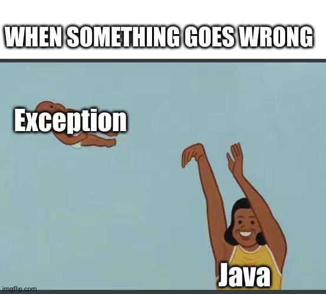

# Java

:cheese_wedge: 前置知识：OOP

:mortar_board: 讲师：朱煜章 @Clancy

:date: 日期：7 月 26 日星期三

---

尽管近年来面临一些新兴语言的挑战，Java 由于它的跨平台性、良好的安全性、前向兼容性以及不算差的性能，仍是一门历史地位和业界地位都极其崇高的语言。庞大的 Java 社区和海量的 Java 项目使得对任何想要接触业界的贵系同学来说，你也许可以不精通它，但至少应当对这门简单、强大、通用的语言有一些了解。此外，本课程还会简单介绍 Kotlin, Scala 等基于 Java 虚拟机的（更现代化的）语言。


## 课前准备

**本课程需要先修《面向对象程序设计》（OOP）。**

要运行 Java 程序，你需要先安装 Java Developer Kit (JDK) 。Windows 或 Mac 用户建议直接在 Oracle 官网下载 JDK17（[Java Downloads | Oracle](https://www.oracle.com/java/technologies/downloads/#java17)）。而 Linux 用户（这里以 Ubuntu 为例，其余平台请自行百度 / Google）则可以使用如下命令：

```bash
sudo add-apt-repository ppa:linuxuprising/java
sudo apt update
sudo apt install oracle-java17-installer --install-recommends
```

本教程就会使用这一版本。请使用`java -version`命令来确认 JDK 是否安装完成。

你可以使用如下命令编译运行 Java 程序：

```bash
javac YourProgram.java  # 编译
java YourProgram        # 运行
# OR 
java YourProgram.java   # 编译 & 运行
```

你也可以使用`jshell`这一命令行式窗口运行一些简单的`java`脚本（~~玩具性质居多~~）。

建议使用 IntelliJ IDEA 这一广泛应用的 Java IDE 编写 Java 程序，可在 https://www.jetbrains.com/idea/ 下载。如果你是清华大学学生，可以使用清华邮箱（使用`mails.thu.edu.cn`后缀，而非`mails.tsinghua.edu.cn`），在 [免费教育许可证 - 社区支持 (jetbrains.com.cn)](https://www.jetbrains.com.cn/community/education/#students) 注册学生包，获取功能更加强大的 Ultimate 版本。


## Java 的历史 & 设计理念

Java 发明于20世纪90年代初，由 Sun Microsystems（后来被 Oracle 收购）的工程师团队开发。最初的目标是创建一种用于家电设备的编程语言。1995年，Java 1.0 正式发布，带来了跨平台的能力，也就是 "Write Once, Run Anywhere"（一次编写，随处运行）。这一特性是通过将 Java 代码编译为中间表示形式（字节码）实现的，然后在任何支持 Java 虚拟机（JVM）的平台上运行。随着时间的推移，Java 不仅仅成为一种用于嵌入式系统的语言，它还发展成为一种强大的服务器端、企业级应用、Web和移动应用的开发语言。

Java 的设计亮点是 Java 虚拟机（Java Virtual Machine，JVM）和字节码（Bytecode）。JVM 提供一个跨平台的运行环境，使得 Java 程序可以在不同的操作系统和硬件平台上运行。字节码是 Java 源代码编译生成的中间表示形式，它是一种与平台无关的低级指令集，使得 Java 实现了跨平台的能力。这两个概念是 Java 的关键组成部分，为 Java 的跨平台性和可移植性提供了基础。

Java 在设计上注重安全性。它提供了安全管理器（Security Manager）和沙箱（Sandbox）机制，用于限制程序的访问权限和执行环境，以防止恶意代码对系统的破坏。举个例子，Java 不允许数组下标越界访问。

Java 是一种面向对象（OOP）语言。如果你还不知道 OOP 是什么，可以理解为使用类和对象的编程范式：类是对象的模板，定义了一系列行为相同的对象；对象是类的实例化。如果这很难理解，你可以认为：人是一个类，“某个特定的人”是一个对象。面向对象的程序是以一系列对象的方法（函数），而非一系列过程来驱动的。

关于 Java 的 OOP 特性将在后面详细介绍。


## 从例子学 Java 语法

本章列举了一些基本的 Java 语法，相信聪明的你一看就会。

#### Helloworld.java

```java
public class Helloworld {
	public static void main(String[] args) { // main method for Java program
		System.out.println("Hello World!"); // ends with a new line
		System.out.print("Hello World!"); // does not end with a new line
	}
}
```

#### Variables.java

```java
import java.lang.Math;
import java.lang.String;
public class Variables {
    public static void main(String[] args) {
        int myNumber;
        myNumber = 42;
        long myPhone = 12345678900L;
		float myGPAf = 4.0f; // or (float) 4.0
        float myGPAf = 4.0f;
        boolean javaIsCool = true;
        char myGrade = 'A';  // Unicode. 16 bits
        String myName = "Clancy";
        var x = Math.random(); // inferred type
        int[] myArray = {1, 2, 3, 4, 5};
        int[][] myMatrix = new int[2][3];
    }
}
```

#### Operaters.java

```java
import java.util.Arrays;
import java.lang.String;
public class Operators {
    public static void main(String[] args) {
        int a = 114;
        int b = 514;
        System.out.println("a + b = " + (a + b));
        System.out.println("a - b = " + (a - b));
        System.out.println("a * b = " + (a * b));
        System.out.println("a / b = " + (a / b)); // int / int = int
        System.out.println("a / b = " + (a / (double)b)); // int / double = double
        System.out.println("a % b = " + (a % b));
        System.out.println("a++ = " + (a++));
        System.out.println("++a = " + (++a));
        System.out.println("b += 100 = " + (b+=100));
        System.out.println("a == b = " + (a == b));
        System.out.println("a != b = " + (a != b));
        System.out.println("a > b = " + (a > b));
        System.out.println("a >= b = " + (a >= b));
        System.out.println("a & b = " + (a & b));
        System.out.println("a | b = " + (a | b));
        System.out.println("a ^ b = " + (a ^ b));
        System.out.println("~a = " + (~a));
        System.out.println("a << 2 = " + (a << 2));
        System.out.println("-a >> 2 = " + (-a >> 2)); // Arithmetic shift
        System.out.println("-a >>> 2 = " + (-a >>> 2)); // Logical shift
        boolean c = true;
        boolean d = false;
        System.out.println("c && d = " + (c && d));
        System.out.println("c || d = " + (c || d));
        System.out.println("!c = " + (!c));
        System.out.println("c ? 'T' : 'F' = " + (c ? 'T' : 'F'));
        String e = "Hello";
        String f = """
            		World
            	   """;
        System.out.println("e + f = " + (e + f));
        System.out.println("e == f = " + (e == f));
        System.out.println("e != f = " + (e != f)); 
        System.out.println("e.compareTo(f) = " + (e.compareTo(f)));
        System.out.println("e.equalsIgnoreCase(f) = " + (e.equalsIgnoreCase(f)));
        System.out.println("e.contains(f) = " + (e.contains(f)));
        System.out.println("e.startsWith(f) = " + (e.startsWith(f)));
        System.out.println("e.length() = " + (e.length()));
        System.out.println("e.charAt(0) = " + (e.charAt(0)));
        System.out.println("e.indexOf('l') = " + (e.indexOf('l')));
        System.out.println("e.substring(1, 3) = " + (e.substring(1, 3)));
        System.out.println("e.toUpperCase() = " + (e.toUpperCase()));
        System.out.println("e + 114 = " + (e + 114));
        int[] g = {1, 1, 4, 5, 1, 4};
        System.out.println("g.length = " + g.length);
        System.out.println("g[0] = " + g[0]);
        System.out.println("Arrays.toString(g) = " + Arrays.toString(g));
        System.out.println("Arrays.equals(g, g) = " + Arrays.equals(g, g));
        System.out.println("Arrays.binarySearch(g, 4) = " + Arrays.binarySearch(g, 4));
        System.out.println("Arrays.copyOf(g, 3) = " + Arrays.toString(Arrays.copyOf(g, 3)));
        System.out.println("Arrays.copyOfRange(g, 1, 3) = " + Arrays.toString(Arrays.copyOfRange(g, 1, 3)));
        Arrays.sort(g);
        System.out.println("Arrays.sort(g) = " + Arrays.toString(g));
        Arrays.fill(g, 0);
        System.out.println("Arrays.fill(g, 0) = " + Arrays.toString(g));
        System.out.println("Arrays.hashCode(g) = " + Arrays.hashCode(g));
    }
}
```

#### ClassWithFunctions.java

```java
public class ClassWithFunctions {
    public void function(int a, int b) {
        System.out.println("a + b = " + (a + b));
    }
    public int functionWithReturn(int a, int b) {
        return a + b;
    }
    public char functionWithIf(int a, int b) {
        if (a > b) {
            return '>';
        } else if (a < b) {
            return '<';
        } else {
            return '=';
        }
    }
    public void functionWithWhile(int a, int b) {
        while (a < b) {
            System.out.println("a = " + a);
            a++;
        }
    }
    public void functionWithDoWhile(int a, int b) {
        do {
            System.out.println("a = " + a);
            a++;
        } while (a < b);
    }
    public void functionWithFor(int a, int b) {
        for (int i = a; i < b; i++) {
            System.out.println("i = " + i);
        }
    }
    public void functionWithSwitch(int a) {
        switch (a) {
            case 1:
                System.out.println("a = 1");
                break;
            case 2:
                System.out.println("a = 2");
                break;
            case 3:
                System.out.println("a = 3");
                break;
            default:
                System.out.println("a = " + a);
        }
    }
    public void functionWithSwitch2(int a) {
        System.out.println("a = " +
            switch (a) {
                case 1 -> "one";
                case 2 -> "two";
                case 3 -> "three";
                default -> {
                    if (a > 3) {
                        yield "more than three";
                    } else {
                        yield "less than one";
                    }
                }
            }
        );
    }
    public static void main(String[] args) {
        ClassWithFunction obj = new ClassWithFunction();
        obj.function(1, 5);
        System.out.println("a + b = " + obj.functionWithReturn(1, 5));
        System.out.println("a " + obj.functionWithIf(1, 5) + " b");
        obj.functionWithWhile(1, 5);
        obj.functionWithDoWhile(1, 5);
        obj.functionWithFor(1, 5);
        obj.functionWithSwitch(1);
    }
}
```

#### ConsoleIO.java

```java
import java.util.Scanner;
public class ConsoleIO {
	public static void main(String[] args) {
        Scanner input = new Scanner(System.in);
        System.out.print("Enter your name: ");
        String name = input.nextLine();
        System.out.print("Enter your age: ");
        int age = input.nextInt();
        System.out.println("Hello " + name + ", you are " + age + " years old!");
	}
}
```

#### HashMapExample.java

```java
import java.util.*;
public class HashMapExample{
    public static void main(String[] args){
        // Create a hash map
        var hm = new HashMap(); // or HashMap<String, Double>
        // Put elements to the map
        hm.put("Clancy", new Double(3434.34));
        hm.put("abmfy", new Double(123.22));
        hm.put("kaiming", new Double(1378.00));
        // Get a set of the entries
        Set set = hm.entrySet();
        // Get an iterator
        Iterator i = set.iterator();
        // Display elements
        while(i.hasNext()){
            Map.Entry me = (Map.Entry)i.next();
            System.out.print(me.getKey() + ": ");
            System.out.println(me.getValue());
        }
        System.out.println();
        // Deposit 1000 into Clancy's account
        double balance = ((Double)hm.get("Clancy")).doubleValue();
        hm.put("Clancy", new Double(balance + 1000));
        System.out.println("Clancy's new balance: " + hm.get("Clancy"));
    }
}
```

#### ExceptionHandeling.java

```java
import java.util.Scanner;

public class ExceptionHandeling {
    public static void main(String[] args) {
        Scanner sc = new Scanner(System.in);
        System.out.println("Enter a number: ");
        try {
            int n = sc.nextInt();
            int result = 100 / n; // if n = 0 then exception will be thrown
            if(result < 0)
                throw new IllegalArgumentException("Number is negative"); // custom exception
            System.out.println("Result: " + result);
        } catch (ArithmeticException e) { // will be executed if n = 0
            System.out.println("Exception: " + e.getMessage());
        } catch (Exception e) { // will be executed if other exception occurs
            e.printStackTrace();
        } finally { // will be executed always
            System.out.println("Finally block is always executed");
	        sc.close();
        }
    }
}
```



## Java OOP

Java 最初的设计目标之一就是成为一种纯粹的面向对象语言。所有的代码都必须包含在类（class）中，基本上所有元素都是对象（基本数据类型除外）。它支持封装、继承和多态等面向对象的核心概念，并鼓励开发者使用这些概念构建模块化和可重用的代码。具体地说，**所有的 Java 代码都需要封装在类里，每一个 .java 文件恰有一个与其同名的 `public`类**。

> ⾯向对象编程的基本流程为： 
>
> 1. 设计类 `class Car { /* ... */ } `
> 2. 创建/实例化对象 `var myCar = new Car(); `
> 3. 向对象发送消息 `myCar.move();`

Java 使用自动内存管理机制，也就是垃圾回收（Garbage Collection）。开发者不需要显式地分配和释放内存，这减轻了开发负担并减少了内存泄漏和悬挂指针等常见的错误。也就是说，**Java 没有指针的概念，函数传参只有传值没有传引用，程序员只需要`new`而不需要考虑`delete`一个对象**。

Java 通过封装的概念将数据和操作封装在对象中。对象可以隐藏其内部状态和实现细节，只暴露出对外提供的接口。这种封装性可以保护数据的安全性和一致性，并提供更好的模块化和代码组织。

#### Car.java

```java
public class Car {
    {
        // This is an instance block
        System.out.println("I initialize before the constructor");
    }
    private String brand;
    private String model;
    private String color = "black"; // default value
    private int currentSpeed;
    private int price;
    private final int maxSpeed = 200; // final means constant
    public static int numberOfCars = 0; // static means shared between all objects
    public Car(String brand, String model, int price) {
        this.brand = brand;
        this.model = model;
        this.price = price;
        numberOfCars++;
    }
    
    // You can have multiple constructors with different parameters 
    public Car(String brand, String model, String color, int price) {
        this(brand, model, price);
        this.color = color;
    }
    public void accelerate(int speed) {
        if (currentSpeed + speed > maxSpeed) {
            currentSpeed = maxSpeed;
        } else {
            currentSpeed += speed;
        }
    }
    public double move(double time) {
        return currentSpeed * time;
    }
    /* 
     * Getters and Setters
     * They are used to access private fields
     * You can generate them automatically in many IDEs
     */
    public String getBrand() {
        return brand;
    }
    public void setBrand(String brand) {
        this.brand = brand;
    }
    @Override
    public String toString() {
        return "Car [brand=" + brand + ", model=" + model + ", color=" + color + ", currentSpeed=" + currentSpeed
                + ", price=" + price + ", maxSpeed=" + maxSpeed + "]";
    }
    public static void main(){
        Car car = new Car("BMW", "X5", 100000); // create a new object
        System.out.println(car);
        car.setBrand("Mercedes"); // car.brand = "Mercedes" is not allowed
        car.accelerate(100);
        System.out.println(car.move(2));
        // You don't need to delete objects in Java
    }
}
```

**继承**是面向对象编程的重要特性，Java 通过继承机制实现了类之间的层次关系。通过继承，一个类可以从另一个类继承属性和方法，并在此基础上进行扩展和特化。继承提供了代码重用的机制，使得开发者能够构建层次化的、更具扩展性的代码结构。如果你不指定基类，你的类就会继承自`java.lang.Object`类。

**多态性**意味着同一个方法名可以在不同的对象上具有不同的实现，是继承的最大意义之一。通过多态性，可以实现基于对象的动态行为和方法的重写。多态性使得代码更具灵活性和可扩展性，可以根据不同的对象类型进行适应性的行为。

尽量不要在构造器中使⽤多态函数，否则基类构造器可能会错误调用子类的多态函数，但是此时子类的数据还未被正确初始化，这可能会导致异常崩溃。

#### Worker.java

```java
public class Worker {
    private String name;
    private int age;
    private int salary;
    protected String position;

    public Worker(String name, int age, int salary, String position) {
        this.name = name;
        this.age = age;
        this.salary = salary;
        this.position = position;
    }
    public String getName() {
        return name;
    }
    public int getAge() {
        return age;
    }
    public int getSalary() {
        return salary;
    }
    public String getPosition() {
        return position;
    }
    public void work(){
        System.out.println(name + "is working");
    }
}
```

#### Engineer.java

```java
package javacourseofclancy.part2; //using package to organize classes
public class Engineer extends Worker {
    private String speciality;
    public Engineer(String name, String surname, int age, String speciality) {
        super(name, surname, age); // since super class has private fields, we need to use constructor
        this.speciality = speciality;
    }
    public String getSpeciality() {
        return speciality;
    }
    public void setSpeciality(String speciality) {
        this.speciality = speciality;
        if(speciality == "CS") {
            this.position = "Software Engineer"; // 'position' is a protected field of the parent class
        }
    }
    // override has the same signature and parameters as the parent class
    @Override
    public void work() {
        System.out.println(this.name + "is working as an "+ this.speciality+" engineer");
    }
    public void fixBug() {
        System.out.println(this.name + "is fixing a bug");
    }
}
```

#### Company.java

```java
package javacourseofclancy.part2;
import java.util.ArrayList;
public class Company{
    private ArrayList<Worker> workers;
    public employ(Worker worker){
        workers.add(worker); // upcasting
    }
    public onBusiness(){
        for(int i=0; i<workers.length; i++){
            workers[i].work(); // polymorphism
            if(workers[i] instanceof Engineer){
                ((Engineer)workers[i]).fixBug(); // downcasting
            }
            /* or
             *  if(workers[i] instanceof Engineer engineer){
             *      engineer.fixBug();
             *  }
             */ 
            /* even
             *  if(!(workers[i] instanceof Engineer engineer)){
             *     continue;
             * }
             * engineer.fixBug();
             */
        }
    }
}
```

注意，“组合优先于继承”，例如我们在这里不将公司实现为“工人列表”的子类。

我们可以使用 `abstract` 类表示不能被实例化的抽象基类：这些基类含有未实现的抽象方法。

#### Shape.java (ver 1)

```java
public abstract class Shape {
    public abstract double area();
    public abstract boolean inside(double x, double y);
}
```

#### Circle.java (ver 1)

```java
class Circle extends Shape {
    private double r;
    public Circle(double r) { this.r = r; }
    @Override public double area() { return Math.PI * r * r; }
    @Override public boolean inside(double x, double y) {
	    return x * x + y * y < r * r;
    }
}
```

**Java 只允许单重继承，假如你想要实现类似多重继承的写法，需要使用“接口”**。interface 实际上是 abstract class 的进⼀步抽象形式。 abstract class 允许含有抽象方法和非抽象方法，而 interface 只定义了抽象方法，并且 也不被允许有成员域。接口允许类似 C++ 的“多重继承”。接口中的方法都为 public abstract ，无需再次声明。Java允许接口内存在带有实现的 default 方法或 static 方法。

#### Shape.java (ver 2)

```java
interface Shape {
    double area();
    boolean inside(double x, double y);
    default boolean outside(double x, double y) {
	    return !inside(x, y);
    }
}
```

#### Circle.java (ver 2)

```java
class Circle implements Shape { // you can implement multiple interfaces
    private double r;
    public Circle(double r) { this.r = r; }
    @Override public double area() { return Math.PI * r * r; }
    @Override public boolean inside(double x, double y) {
	    return x * x + y * y < r * r;
    }
}
```

注意，如果类实现了两个具有相同 default 方法的接口，会出现实现歧义。 在 Java 中，如果出现这种情况，你必须通过 `<interface>.super.<function>(args)` ⼿动指定使用的接口。

**内部类**是定义在另一个类内部的类。它们在外部类的范围内，可以访问外部类的成员，包括私有成员。内部类使得代码更加清晰和模块化，并且通过内部类的继承，允许实现类似多重继承的功能。你可以在任意的作用域内定义内部类。

#### Socket.java

```java
public class Socket {
    private int voltage;

    public Socket(int voltage) {
        this.voltage = voltage;
    }
    public void plugIn() {
        System.out.println("You are using a " + voltage + "V socket.");
        TwoPinPlug twoPinPlug = new TwoPinPlug();
        twoPinPlug.connect();
        ThreePinPlug threePinPlug = new ThreePinPlug();
        threePinPlug.connect();
    }
    private class TwoPinPlug {
        public void connect() {
            System.out.println("You are using a two-pin plug.");
        }
    }
    private class ThreePinPlug {
        public void connect() {
            System.out.println("You are using a three-pin plug.");
        }
    }
}

```

**Lambda 表达式**是 Java 8 引入的一个重要特性，它提供了一种更简洁、更灵活的编码方式来实现函数式编程。Lambda 表达式是一种匿名函数，它可以作为参数传递给方法或存储在变量中。Lambda 表达式使得代码更具可读性和可维护性，并提供了更高级的函数式编程功能，如函数式接口、方法引用和流式操作等。Lambda 表达式的语法简洁，由参数列表、箭头符号和表达式主体组成。

#### SortName.java

```java
import java.util.ArrayList;
import java.util.Collections;
import java.util.List;

public class SortName {
    public static void main(String[] args) {
        List<String> names = new ArrayList<>();
        names.add("Clancy");
        names.add("abmfy");
        names.add("kaiming");
        names.add("c7w");
        names.add("Lambda");
		// lambda expression
        Collections.sort(names, (String a, String b) -> a.compareTo(b));

        for (String name : names) {
            System.out.println(name);
        }
    }
}
```

**枚举类**（Enum）是一种特殊的类，用于表示一组有限的命名常量。枚举类在 Java 中被广泛应用，用于定义一组固定的值，以及与这些值相关联的方法和属性。

#### Day.java

```java
public enum class Day {
    SUNDAY, MONDAY, TUESDAY, WEDNESDAY, THURSDAY, FRIDAY, SATURDAY;
    public boolean isWeekend() {
        return this == SATURDAY || this == SUNDAY;
    }
    public static void main(String[] args) {
        var day = Day.MONDAY;
		System.out.println(day); // = day.toString()
        System.out.println(day.ordinal());
        System.out.println(day.isWeekend());
    }
}
```

#### VehicleExample.java

```java
public class VehicleExample {
    public static void main(String[] args) {
        VehicleType type = VehicleType.CAR;
        System.out.println("Vehicle type: " + type);
        System.out.println("Maximum speed: " + type.getMaxSpeed() + " km/h");
    }
}

enum VehicleType {
    CAR(200),
    MOTORCYCLE(180),
    TRUCK(120),
    BICYCLE(30);
    private int maxSpeed;

    VehicleType(int maxSpeed) {
        this.maxSpeed = maxSpeed;
    }
    public int getMaxSpeed() {
        return maxSpeed;
    }
}
```

**泛型**（Generics）用于在编译时期提供更强类型检查和更好的代码重用。它允许在类、接口和方法中使用参数化类型，以便在使用时指定具体的类型。

#### Generics.java

```java
import java.util.ArrayList;
import java.util.List;

public class Generics {
    public static void main(String[] args) {
        // Generic class
        Box<String> stringBox = new Box<>("Hello, World!");
        String content = stringBox.getContent();
        System.out.println("Content: " + content);

        // Generic method
        Integer[] numbers = {1, 2, 3, 4, 5};
        Utils.printArray(numbers);

        // Bounded type parameters
        List<Integer> integerList = new ArrayList<>();
        integerList.add(10);
        integerList.add(20);
        integerList.add(30);
        double sum = MathUtils.sum(integerList);
        System.out.println("Sum: " + sum);
    }
}

class Box<T> {
    private T content;

    public Box(T content) {
        this.content = content;
    }

    public T getContent() {
        return content;
    }
}
class Utils {
    public static <T> void printArray(T[] array) {
        for (T element : array) {
            System.out.println(element);
        }
    }
}
class MathUtils {
    public static <T extends Number> double sum(List<T> numbers) {
        double total = 0.0;
        for (T number : numbers) {
            total += number.doubleValue();
        }
        return total;
    }
}
```

**异步编程**是一种处理并发和并行任务的常见方式。它允许程序在执行某个任务时不必等待该任务的完成，而是继续执行其他任务。Java提供了多种机制来实现异步编程，我在这里介绍其中一种使用 `Runnable` 接口的方法，有兴趣的同学请自行搜索其他~~（不那么好看的）~~写法。

`Runnable`接口是Java多线程编程中的一个核心接口。它定义了一个单一方法`run()`，用于封装线程的执行逻辑。通过实现`Runnable`接口并重写`run()`方法，可以创建可在多个线程中执行的任务。

匿名可执行类实现了`Runnable`接口的`run()`方法，定义了线程的具体行为。我们创建一个`Thread`对象，将可执行类的对象作为参数传递给`Thread`的构造函数。通过调用`Thread`对象的`start()`方法，线程开始执行并运行匿名可执行类的代码。我们在这里选择创建匿名`Runnable`实例，将线程的逻辑直接定义在线程创建的地方，避免显式地定义一个独立的类。这种写法更加紧凑和便捷。

注意：尽管匿名`Runnable`实例写起来很美观便捷，但如果线程逻辑需要复用，建议使用具名的`Runnable`实现类来提高代码的可读性和可维护性。

#### MultiThreadExample.java

```java
public class MultiThreadExample {
    public static void main(String[] args) {
        // create and start the first thread
        new Thread(new Runnable() {
            @Override
            public void run() {
                for (int i = 0; i < 3; i++) {
                    System.out.println("Thread 1: " + i);
                    try {
                        Thread.sleep(1000); // pause 1 second
                    } catch (InterruptedException e) { // exception occurs when thread is interrupted
                        e.printStackTrace();
                    }
                }
            }
        }).start();

        // create and start the second thread
        new Thread(new Runnable() {
            @Override
            public void run() {
                for (int i = 0; i < 3; i++) {
                    System.out.println("Thread 2: " + i);
                    try {
                        Thread.sleep(1000);
                    } catch (InterruptedException e) {
                        e.printStackTrace();
                    }
                }
            }
        }).start();

        // main thread
        for (int i = 0; i < 3; i++) {
            System.out.println("Main thread: " + i);
            try {
                Thread.sleep(1000);
            } catch (InterruptedException e) {
                e.printStackTrace();
            }
        }
    }
}
```

最后，我们介绍简单的 **Java GUI**（图形用户界面）语法。Java 提供了许多用于 GUI 开发的库和工具，其中 Java Swing 是 Java 的原始 GUI 库，已经存在了很长时间，并被广泛应用于 Java 应用程序的开发中。它提供了一套丰富的组件（如按钮、标签、文本框、下拉列表等），可以用来构建各种用户界面。Swing 提供了高度可定制的界面风格，并支持事件处理和绘图功能。

#### GUIExample.java

```java
import javax.swing.*;
import java.awt.*;
import java.awt.event.ActionEvent;
import java.awt.event.ActionListener;
import java.awt.event.MouseAdapter;
import java.awt.event.MouseEvent;
import javax.swing.event.MouseInputAdapter;

public class GUIExample {
    public static void main(String[] args) {
        // create a frame
        JFrame frame = new JFrame("GUI Example");
        frame.setDefaultCloseOperation(JFrame.EXIT_ON_CLOSE);
        frame.setSize(400, 300);

        // create a panel
        JPanel panel = new JPanel() {
            private boolean isClicked = false;

            @Override
            protected void paintComponent(Graphics g) {
                super.paintComponent(g);

                // draw a rectangle
                g.setColor(Color.RED);
                g.fillRect(50, 50, 100, 100);

                // draw a circle
                Color circleColor = isClicked ? Color.GREEN : Color.BLUE;
                g.setColor(circleColor);
                g.fillOval(200, 50, 100, 100);

                // when left-clicked on the circle, change the color to green
                addMouseListener(new MouseAdapter() {
                    @Override
                    public void mouseClicked(MouseEvent e) {
                        if (e.getX() >= 200 && e.getX() <= 300 && e.getY() >= 50 && e.getY() <= 150) {
                            isClicked = true;
                            repaint();
                        }
                    }
                });
            }
        };

        // create a label
        JLabel label = new JLabel("Hello, World!");
        label.setHorizontalAlignment(JLabel.CENTER);

        // create a button
        JButton button = new JButton("Click Me!");

        // add action listener to the button
        button.addActionListener(new ActionListener() {
            public void actionPerformed(ActionEvent e) {
                label.setText("Button Clicked!");
            }
        });

        // set layout of the panel
        panel.setLayout(new BorderLayout());
        panel.add(label, BorderLayout.NORTH);
        panel.add(button, BorderLayout.SOUTH);

        // add panel to the frame
        frame.getContentPane().add(panel);

        // set frame visible
        frame.setVisible(true);
    }
}
```

## Kotlin & Scala 简介

这部分内容属于扩展，也不会在作业里有要求。本着“差不多得了”的原则，在课堂上我会能讲多少讲多少，绝不拖堂，~~大家就当听个乐子得了~~。


### Kotlin

Kotlin是一种现代化的静态类型编程语言，它可以运行在Java虚拟机（JVM）上，也可以不在JVM上运行，而是编译为本地代码，从而在其他平台上运行，如iOS、Web和嵌入式系统。它由JetBrains开发，并于2011年首次公开发布。Kotlin引入了许多现代编程语言的特性，如类型推断、空安全、扩展函数等，从而减少了冗余代码的编写。

### Scala

Scala 始于 2001 年，由洛桑联邦理工学院(EPFL)的编程方法实验室研发。它是纯面向对象的（意味着 1 这样的常值也是对象），结合了面向对象编程和函数式编程的特性。Scala 源代码被编译成 Java 字节码，所以它可以运行于 JVM 之上，并可以调用现有的 Java 类库。Scala的设计秉承一项事实，即在实践中，某个领域特定的应用程序开发往往需要特定于该领域的语言扩展。Scala提供了许多独特的语言机制，可以以库的形式轻易无缝添加新的语言结构。

Kotlin 和 Scala 可以直接调用 Java 类和方法，也可以被 Java 代码调用。这意味着开发人员可以逐步将现有的 Java 代码迁移到这些语言，而无需一次性地进行全面改写。

我将用几个例子表现 Kotlin、Scala 和 Java 的区别（优势）。首先，最显明的一点是，Kotlin、Scala 代码不需要仅包含一个 public 类，而是可以含有很多 public 类和**函数**（ Java：函数是什么？），当然也就不用命名为 public 类了。其次，Kotlin 和 Scala 都是变量类型在变量名后方，而且语句不用加分号。

#### Hello.kt

```kotlin
class Greeter(val name: String) {
   fun greet() { 
      println("Hello, $name")
   }
}
 
fun main(args: Array<String>) {
   Greeter("World!").greet()  // yes, no 'new' required!
}
```

Kotlin 对**空值处理**提供了内置的支持。在 Kotlin 中，通过在类型声明中使用可空性标志（?）来明确指示一个变量是否可以为null，从而减少了空指针异常的发生。使用安全调用操作符（?.），我们可以在获取对应属性时进行空值检查。如果原来的对象为`null`，表达式将返回`null`，否则将返回正常结果。使用非空断言操作符（!!）时，我们则断言对象不为`null`（注意，这可能会导致空指针异常）。

#### Nullable.kt

```kotlin
fun main() {
    val nullableString: String? = null
    val length = nullableString?.length // safe call operator

    if (length != null) {
        println("String length: $length")
    } else {
        println("String is null")
    }

    val nonNullString: String? = "Hello, Kotlin!"
    val uppercase = nonNullString!!.toUpperCase() // non-null assertion operator

    println("Uppercase string: $uppercase")
}
```

Kotlin提供了一些简化集合操作的语法糖，如filter、map、reduce等，使得对集合的操作更加简洁和流畅。

#### ListExample.kt

```kotlin
data class Person(val name: String, val age: Int) 

fun main() {
    val people = listOf(
        Person("Alice", 25),
        Person("Bob", 30),
        Person("Charlie", 20),
        Person("Dave", 35)
    )

    // Filter people over 30
    val filteredPeople = people.filter { it.age >= 30 }
    println("Filtered People:")
    filteredPeople.forEach { println(it) }

    // Map people to names
    val names = people.map { it.name }
    println("\nNames:")
    names.forEach { println(it) }

    // Sort people by age
    val sortedPeople = people.sortedByDescending { it.age }
    println("\nSorted People:")
    sortedPeople.forEach { println(it) }

    // Reduce people to total age
    val totalAge = people.map { it.age }.reduce { acc, age -> acc + age }
    println("\nTotal Age: $totalAge")

}
```

Kotlin 提供了**协程**（Coroutines）的支持，这是一种轻量级的并发编程机制。协程使得编写异步、非阻塞的代码更加自然。

#### SleepyClancy.kt

```kotlin
import kotlinx.coroutines.*

fun main() {
    // launch a coroutine in the background
    GlobalScope.launch {
        println("Clancy goes to sleep")
        delay(1000) // sleep for 1 second
        println("Clancy wakes up")
    }

    println("Main thread is continuing")

    // stuck here until the coroutine finishes
    runBlocking {
        delay(2000)
    }

    println("Main thread is done")
}
```

Scala 支持**函数式编程**，提供了丰富的函数式编程特性。开发者可以使用高阶函数、匿名函数、不可变数据结构等功能来编写“简洁、可维护”的函数式代码。

#### Functional.scala

```scala
def sumOfEvenSquares(numbers: List[Int]): Int = {
  numbers
    .filter(_ % 2 == 0)
    .map(num => num * num)
    .sum
}

val numbers = List(1, 2, 3, 4, 5, 6, 7, 8, 9, 10)
val result = sumOfEvenSquares(numbers)

println(result)
```

Scala 的灵活性使其成为构建**领域特定语言**（Domain-Specific Language，DSL）的理想选择。也就是说，Scala 很适合编写代码生成器（尽量不要将它用于其他**任何**领域）。所以我就不在这里过多介绍了（~~如果你真的对这个语言有兴趣，来跟我私聊吧~~）。